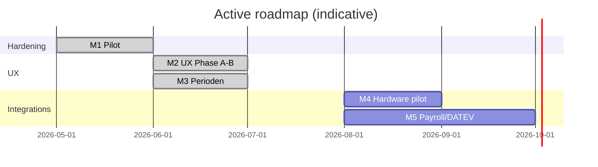

# AI TimeShards — Product Roadmap (active)

**Last updated:** 2026-06-03 · **Shipping line:** v0.2.x (time foundation + access simulation + payroll CSVs)

**Implementation status (2026-06-03):** M1–M5 code paths are in `main`. Open items are **pilot/ops** (site hardware bridge, DATEV column feedback), not blocked on new features. See [STATUS.md](./STATUS.md).

This is the **canonical plan** for what we build next. It reflects the **monolithic Axum API + two Tauri apps** in the repo today—not the optional micro-kernel experiment in `crates/timeshards-kernel`.

| Document | Role |
|----------|------|
| **This file** | Near-term milestones, acceptance criteria, priority |
| [STATUS.md](./STATUS.md) | What is shipped *right now* |
| [docs/FOUNDATION.md](./docs/FOUNDATION.md) | Time model (Soll/Ist) — implemented scope |
| [docs/PHASE2.md](./docs/PHASE2.md) | Post-v1 tracks (DATEV, hardware, …) |
| [docs/UI_UX_GUIDE.md](./docs/UI_UX_GUIDE.md) | Server + client UI/UX refactor phases |
| [ROADMAP_DETAILS.md](./ROADMAP_DETAILS.md) | Long-range vision & feature catalog (not all scheduled) |
| Appendix below | Deferred **platform / shard** architecture |

---

## 1. North star

**Germany-first desktop** time tracking and access control in **one product**: intuitive for first-time users, strict enough for HR and works-council-oriented workflows (ArbZG-oriented warnings, audit-friendly logs, clear Soll from calendars—not from shift templates alone).

**Success for the next 6 months:** one pilot customer runs **demo off**, stable CI, payroll handoff via CSV, and optional **one real door** on the external hardware adapter.

---

## 2. Shipped baseline (do not re-plan)

Treat as done unless a row is marked **partial**:

| Area | Shipped | Doc |
|------|---------|-----|
| Work calendar → Soll, rebuild, KW Berlin | ✅ | [FOUNDATION.md](./docs/FOUNDATION.md) |
| Stempeln, breaks, timesheets, approve → Konten | ✅ | |
| Month close, Lohn- + Abwesenheiten-CSV, Monats-Paket UI | ✅ | [PAYROLL_EXPORT.md](./docs/PAYROLL_EXPORT.md) |
| Access sim, anti-passback, occupancy, hardware-present | ✅ | [HARDWARE.md](./docs/HARDWARE.md) |
| External TCP ingest (`TIMESHARDS_HW_ADAPTER=external`) | ✅ partial | Not full OEM protocol |
| Go-Live wizard, production checklist, foundation-fix | ✅ | [PRODUCTION.md](./docs/PRODUCTION.md) |
| CI: rust, frontend, smokes, `verify-foundation` | ✅ | `.github/workflows/ci.yml` |
| Perioden UI (tabs, create Tages-/Jahresperiode, klickbare KW) | ✅ partial | [UI_UX_GUIDE.md](./docs/UI_UX_GUIDE.md) |

---

## 3. Milestones (active)

### M1 — Pilot hardening ✅ *mostly complete*

**Goal:** A new install can go live without demo data; ops can verify health and payroll exports.

| Item | Status | Notes |
|------|--------|-------|
| `TIMESHARDS_DISABLE_DEMO`, block default passwords | ✅ | `smoke:production` |
| Foundation health + `foundation-fix` | ✅ | Dashboard KPIs |
| Payroll month bundle + absences CSV smoke | ✅ | v0.2.2 |
| CI smoke stability (GHA PowerShell) | ✅ | `Invoke-RestMethod` pattern |
| [PILOT.md](./docs/PILOT.md) cutover checklist | ✅ | |

**Exit:** `npm run verify:all` + `smoke:production` green; pilot doc walkthrough once on clean DB.

---

### M2 — UX & informativeness ✅ *mostly complete*

**Goal:** Server and client feel like **one modern product**—every important number clickable, clear context on every screen.

| Item | Status | Owner doc |
|------|--------|-----------|
| Shared design tokens (`tokens.css`) | ✅ | `apps/shared/styles/` |
| `TsCard` / `TsPageHeader` / `TsFlash` shared components | ✅ | `apps/shared/ui/` |
| Perioden screen as reference (master–detail, tabs) | ✅ | `WorkCalendarCard` + Feiertage/Umschalt |
| Overview KPIs → deep links | ✅ | `OverviewTab` (incl. Zeit↔Zutritt → Stundenzettel) |
| Stundenzettel row → Tagesdetails | ✅ | `TimesheetsCard` expand + `scope=col` |
| Client Zeit pillar: status + Soll/Ist prominent | ✅ | `ClientTimePillar` hero |
| Zutritt / Personal: pick-list + detail | ✅ | `AccessTab`, `PersonnelTab` |
| Empty states + lead text on all main tabs | ✅ | `TsEmptyState` + subsection leads (Zeit, Client) |

**Exit:** UI guide Phase B checklist; no a11y warnings on new interactive patterns; 2–3 screenshot baselines for regression (optional).

---

### M3 — Perioden & calendar completeness ✅ *mostly complete*

**Goal:** HR can **create and maintain** Tagesperioden and Jahresperioden without SQL or seed-only workflows.

| Item | Status | Notes |
|------|--------|-------|
| CRUD Tagesperioden (create/edit name, Soll, Gleit) | ✅ partial | PUT + POST API; UI tabs |
| CRUD Jahresperioden (create calendar) | ✅ | POST + rename (`PUT` name) |
| KW view: click day → assign model | ✅ | |
| Jahr befüllen + KW kopieren | ✅ | |
| **Feiertagskalender** UI (link to Jahresperiode) | ✅ partial | Tab Feiertage + `PUT` link |
| **Umschaltplan** editor (slots, not only assign) | ✅ partial | Tab Umschaltplan + `PUT …/slots` |
| Full-year grid editor (beyond KW + generate-year) | ✅ partial | Jahresübersicht 12-Monats-Gitter |
| `POST` / `PUT` work-calendars | ✅ | API + UI |

**Exit:** New customer: admin creates 2 Tagesperioden, 1 Jahresperiode, fills year, assigns 3 MA—no server restart required.

---

### M4 — Hardware pilot ✅ *code-ready; site bridge pending*

**Goal:** One production door path via **external adapter** (bridge), not full Wiegand/OSDP in-process yet.

| Item | Status | Notes |
|------|--------|-------|
| `sim` + `external` adapters | ✅ | |
| TCP JSON + compact line + door state | ✅ | `smoke:hw-external` |
| Document bridge deployment | ✅ | [HARDWARE.md](./docs/HARDWARE.md) pilot section |
| Pilot: one reader → one door mapping | ✅ partial | `npm run verify:doors` + site bridge config |
| Fail-closed defaults review (zones without rules) | ✅ | HARDWARE.md + verify:doors allow-rule check |

**Exit:** 1-week pilot log; access events match physical tests; no silent bind failures on restart.

---

### M5 — Payroll & DATEV feedback ✅ *v1 scope locked*

**Goal:** Bureau or DATEV consultant validates CSVs; gaps become a short spec—not a big bang integration.

| Item | Status | Notes |
|------|--------|-------|
| Lohn-CSV + Abwesenheiten-CSV | ✅ | UTF-8 BOM |
| [DATEV.md](./docs/DATEV.md) mapping draft | ✅ | |
| **CSV-only for v1** decision | ✅ | DATEV.md § v1 product decision |
| Column feedback from first pilot payroll run | ⬜ | After first live payroll month |
| Optional: DATEV-native export (Phase 2) | ⬜ | After feedback |

**Exit:** Signed-off column list OR explicit “CSV-only for v1” decision recorded in DATEV.md. ✅

---

### M6 — Enterprise & platform ⬜ *deferred*

Only when a **second site** or central IT requires it:

| Item | Notes |
|------|--------|
| PostgreSQL / central DB | [PHASE2.md](./docs/PHASE2.md) |
| Multi-terminal sync | |
| SaaS / mobile companion | Open questions in ROADMAP_DETAILS |
| Micro-kernel / shard platform | Appendix below; do **not** block M2–M5 |

---

## 4. Suggested execution order (2026 H2)



1. **Pilot:** `TIMESHARDS_DISABLE_DEMO=1`, [PILOT.md](./docs/PILOT.md), `npm run smoke:production`.
2. **Hardware (optional):** external adapter + `npm run verify:doors` before bridge go-live.
3. **Payroll:** export Lohn-CSV after first month; record bureau feedback in [DATEV.md](./docs/DATEV.md).

---

## 5. Quality gates (every milestone)

```powershell
npm run check:all
npm run verify:foundation
npm run smoke:production   # before release / pilot
```

- German UI strings for user-visible text.
- No new vendor product names in docs/UI (see project glossary in UI guide).
- API changes: `docs/API.md` + smoke path if user-facing.

---

## 6. Decision log

| Date | Decision | Rationale |
|------|----------|-----------|
| 2026-06 | **Active roadmap = product monolith**, not micro-kernel | Code and pilots follow Axum + SQLite + 2 apps |
| 2026-06 | Shift templates ≠ Soll | Calendar foundation is source of truth |
| 2026-06 | Payroll v1 = CSV (+ Monats-Paket), DATEV later | Ship pilot; learn columns first |
| 2026-06 | UI/UX guide owns visual refactor | One design system for server + client |
| — | Cloud/SaaS vs on-prem only | **TBD** — default on-prem desktop |
| — | Mobile companion | **TBD** — after pilot stable |

*Add a row when a TBD in ROADMAP_DETAILS is resolved.*

---

## Appendix A — Platform vision (deferred)

The following describes a **future** modular architecture. `crates/timeshards-kernel` is a sketch only; **do not** prioritize kernel work ahead of M2–M5 unless explicitly replanning.

### Micro-kernel idea

- **Kernel:** module registration, lifecycle, event bus only.
- **Shards:** time, access, reporting as plug-ins.
- **UI:** slot/widget registration per module.
- **Data:** storage adapter pattern (SQLite today is fine).

### Phases (platform — not scheduled)

| Phase | Scope |
|-------|--------|
| P-K1 | `IModule`, loader, event bus |
| P-K2 | Timer + storage + basic UI shards |
| P-K3 | Widget API + module manifest |
| P-K4 | Analytics + integrations marketplace |

**Trigger to revisit:** pain from monolith boundaries (e.g. third-party modules, multiple UIs) *after* pilot revenue or a paid extensibility requirement—not before.

---

## Appendix B — Related research

`deep-research-report*.md` — background only; **do not** treat as sprint backlog. Promote items into milestones above before building.
