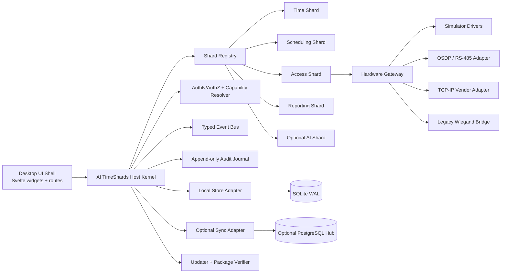
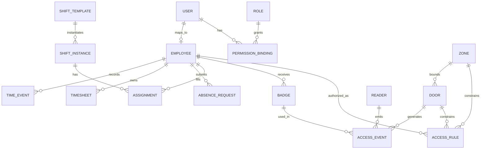
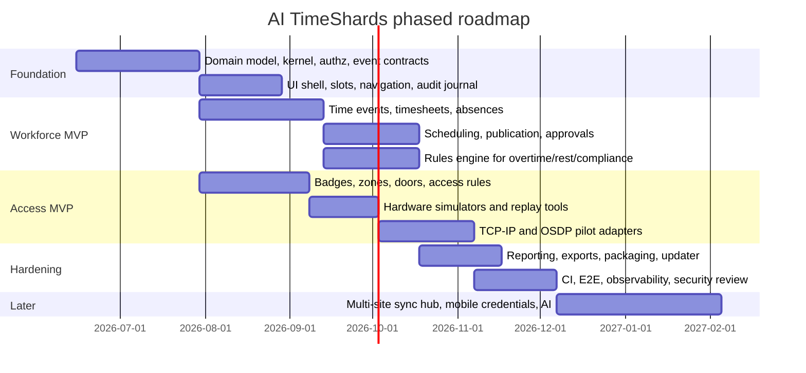

# AI TimeShards Build Specification

## Executive summary

AI TimeShards should be built as a **local-first, modular desktop control plane** for workforce time, scheduling, compliance, and physical access, not as a monolithic HR suite and not as a thin UI over random vendor APIs. The benchmark products all point in the same direction: Primion combines workforce management, time tracking, access control, and integrated security; UKG groups time, attendance, scheduling, analytics, compliance, communication, and AI-assisted forecasting into one workforce platform; HID pushes mobile credentials, API-first access ecosystems, phased migration from legacy readers, and OSDP-based modernization. The implication is clear: the winning product shape is **integrated from the user’s perspective, modular underneath**. citeturn17view0turn21view0turn17view6turn21view7turn17view2turn20view4turn23view0

The strongest implementation path is a **Tauri 2 + Svelte + Rust** desktop shell with a **micro-kernel host** and installable feature shards. Tauri’s architecture is explicitly built around a Rust core plus webview frontend, message-passing, commands/events, capability-based permissions, and signed updater artifacts. SQLite is a strong embedded default because it is ACID, zero-configuration, cross-platform, single-file, supports WAL mode for better concurrency, and exposes JSON, FTS5, and STRICT tables. PostgreSQL should be optional, not mandatory, and used when the product needs multi-site synchronization, centralized reporting, replication, or a shared backend beyond a single desktop node. citeturn44view0turn26view2turn45view3turn26view4turn28view0turn28view1turn29view0turn29view1turn29view3turn30view1turn31view0

The **MVP** should cover: identity and roles, punch capture, timesheets, scheduling basics, absences, overtime rules, badge issuance, zone and door assignment, access event ingestion, audit logs, exportable reporting, admin workflows, and hardware simulators. The MVP should **not** depend on AI, cloud sync, biometrics, payroll calculation, visitor management, or deep ERP integration. Those should be later shards. AI is explicitly unspecified in the request, so it should be treated as an **optional assistive layer**, not a foundation service and not an autonomous decision-maker for payroll or physical access. This is the difference between a buildable product and a scope trap. citeturn17view0turn21view0turn17view6turn21view7turn39view0turn40view3

A realistic effort envelope is **about 14–18 person-months for a serious MVP** and **about 24–32 person-months for a hardened v2** with enterprise sync, advanced reporting, deeper hardware adapters, and AI assistants. The biggest risks are not UI polish. They are **policy correctness, hardware variance, offline behavior, auditability, and privacy compliance**. The system should therefore be opinionated: typed events, append-only audit trails, explicit permission scopes, simulator-first hardware work, and signed releases from day one. citeturn23view0turn20view3turn26view4turn46view0turn45view5turn39view0

## Product vision and scope

The product vision should be framed as: **one desktop host, many bounded shards**. The host owns identity, permissions, storage, audit, update, integration security, and the event backbone. Shards supply domain behavior such as time tracking, scheduling, access control, reporting, and optional AI helpers. This matches the market pattern better than building “one massive admin app,” because the reference products converge functionally but still separate workforce, access, analytics, and mobile access concerns behind modular capabilities and integrations. citeturn17view0turn17view1turn17view6turn21view7turn17view2turn20view4

The request leaves **AI features, exact deployment scale, and final OS support matrix unspecified**. That means the build spec should avoid pretending those decisions are finished. For engineering purposes, the safe assumption is: **single site to moderate multi-site**, **desktop-first**, **Windows-first with macOS and Linux supported by the packaging pipeline**, and **AI as opt-in assistance only** until the product owner defines model hosting, data boundaries, and approval rules. Tauri’s distribution and CI documentation already supports Windows, macOS, Linux, and updater packaging patterns that fit this assumption. citeturn26view3turn26view4turn44view0turn46view2turn46view3

The recommended scope split is below.

| Capability area | MVP | Later phases |
|---|---|---|
| Identity and auth | Users, employees, contractors, roles, permission sets, session controls | SSO, SCIM, delegated admin, org hierarchies |
| Time tracking | Punch in/out, manual correction, break handling, timesheet approval | Geofenced/mobile punches, kiosk mode, advanced exception heuristics |
| Scheduling | Shift templates, assignments, publish/unpublish, swaps with approval | Demand forecasting, skills-based auto-scheduling, coverage optimization |
| Absences | Vacation, sickness, custom leave types, approval chain | Entitlement engines, jurisdiction packs, accrual forecasting |
| Overtime and compliance | Daily/weekly thresholds, rest windows, rule engine, alerts | Collective-agreement packs, jurisdiction DSL, predictive compliance |
| Access control | Badges, readers, doors, zones, schedules, access events | Visitor management, elevator control, interlock/mantrap logic |
| Reporting | Timesheets, anomalies, attendance, access logs, exports | Semantic reports, scheduled distributions, warehouse sync |
| Hardware | Simulators, TCP/IP adapters, basic OSDP/Wiegand compatibility | Vendor certification packs, firmware lifecycle, controller fleets |
| AI | None required for core workflows | Exception triage, schedule suggestions, NL reporting, incident summaries |

The build principle should be ruthless: **every later-phase item must be removable without breaking the kernel**. If a feature cannot be removed cleanly, it is not a shard. It is a leak in the architecture.

## Functional modules and admin workflows

The benchmark feature set is already visible in vendor materials. Primion’s workforce management centers on automated time tracking, compliance with working-time law, recording hours, breaks and overtime, reporting, mobile time tracking, shift and schedule management, and integration with payroll and access control. UKG’s workforce management emphasizes time and attendance, scheduling, analytics, compliance, communication, and AI-guided forecasting. HID’s mobile access push shows where physical access is going: remote credential delivery, phased rollout, support for phones and watches, revocation, MFA, wallet/app experiences, and migration from installed readers toward more secure OSDP-aligned deployments. citeturn21view0turn21view1turn21view3turn21view7turn21view4turn20view3

From that evidence, AI TimeShards should ship the following **first-class shards** in the first wave: **Identity**, **Time**, **Scheduling**, **Absence**, **Rules**, **Access**, **Audit**, **Reporting**, and **Hardware Simulator**. The host should also include a **Policy Engine** because overtime, rest rules, schedule eligibility, and zone access all reduce to policy evaluation over time-bounded facts. Without a policy layer, the app becomes a pile of conditionals and will collapse under real customer rules. citeturn21view0turn21view7turn17view0turn23view0

The functional baseline should look like this.

| Shard | Core responsibilities | Must-write records |
|---|---|---|
| Identity | Users, employees, org units, roles, credentials, employment status | `users`, `employees`, `roles`, `role_bindings`, `credentials` |
| Time | Punches, edits, breaks, balances, approval states | `time_events`, `time_corrections`, `time_balances`, `timesheets` |
| Scheduling | Shift templates, assignments, swaps, publication state | `shift_templates`, `shift_instances`, `assignments`, `schedule_publications` |
| Absence | Leave requests, status, substitutions, entitlements snapshot | `absence_requests`, `absence_decisions`, `entitlement_ledgers` |
| Rules | Overtime, rest, shift eligibility, zone schedules | `policy_sets`, `policy_versions`, `policy_results`, `exceptions` |
| Access | Badges, doors, zones, access schedules, decisions, alarms | `badges`, `doors`, `zones`, `access_rules`, `access_events` |
| Audit | Immutable audit trail, actor/action/object, reason, source | `audit_log` |
| Reporting | Saved reports, export jobs, snapshots | `report_definitions`, `report_runs`, `exports` |
| Hardware Simulator | Fake readers/controllers/events for dev and QA | `device_sim_profiles`, `device_sim_events` |

The critical admin workflows are predictable and should be optimized early because they drive most support load. **Employee onboarding** should create the person record, contract profile, role bindings, badge/mobile credential, zone permissions, and default work calendar in one flow. **Time correction** should preserve the original punch, require a reason, and send approval to a manager when policy requires it. **Schedule publication** should compute conflicts before publish, not after. **Absence approval** should show staffing impact before approval. **Badge issuance** should include credential status, expiration, and revocation path. **Access incident review** should reconstruct a timeline from badge, reader, controller, door, and operator actions without making the admin hunt across five screens. This is exactly where the integrated-product references are strongest: reducing silos between workforce and security data. citeturn17view0turn21view0turn17view6turn20view4

The UX should therefore separate **role-focused daily work** from **deep configuration**. Employees need a lightweight self-service surface for punches, schedules, requests, and badge status. Managers need approvals, exceptions, and staffing views. HR admins need contracts, policies, and reports. Security admins need devices, doors, zones, credentials, incidents, and exports. Auditors need filtered immutable logs. One of the most common enterprise software failures is letting every persona stare at the same navigation tree.

## Architecture and platform design

The recommended architecture is an **application micro-kernel**, not an operating-system kernel. The host process should own: window shell, authentication/session state, shard registry, permission evaluation, local storage, event routing, audit persistence, updater, and integration boundary enforcement. Shards should be isolated by **manifest, permission scope, UI slots, storage namespace, and event contracts**. Tauri maps well to this model because its runtime is already command/event oriented, permissions can be granted or denied per window or webview through capabilities, and updater artifacts are signed and distributed per target platform. citeturn44view0turn26view2turn45view3turn26view4



The **shard lifecycle** should be strict and explicit: `discovered -> verified -> installed -> enabled -> started -> degraded/stopped -> upgraded/quarantined`. Verification means manifest signature and compatibility check. Enablement means permission grant. Start means event subscriptions registered and migrations applied. Quarantine means the shard stays installed but loses runtime rights because of failure, signature mismatch, or policy violation. You want this because hardware integrations and AI helpers are exactly the places where bad plugins will appear first.

The **event bus** should be internal, typed, and boring. Do not overengineer this into full event sourcing for MVP. The right model is: **normalized operational tables** plus a **persisted domain event journal** and a separate **immutable audit log**. Tauri’s own IPC model splits naturally into **Commands** for request/response and **Events** for lifecycle or state-change messages, with JSON-serializable payloads over a JSON-RPC-like protocol. Mirror that inside the product: commands mutate; events notify. Do not let shards write each other’s tables directly. citeturn45view3

The **UI composition model** should use named slots rather than unrestricted component injection. Recommended slots: `dashboard.cards`, `employee.home.actions`, `manager.approvals.panel`, `admin.nav.primary`, `entity.detail.tabs`, `door.detail.sidepanel`, `report.catalog.tiles`, and `incident.timeline.panel`. A shard may register widgets only for allowed slots listed in its manifest. This prevents the UI from becoming extension chaos.

The **hardware boundary** should be a dedicated gateway layer, preferably in-process for simple simulators and vendor-neutral protocols, and sidecar-based when vendor SDKs force foreign runtimes. The access decision path should be designed so that controller-side enforcement still works if the desktop app is down. The desktop host is the control plane, not the last point of physical enforcement. For protocols, the strategic rule is simple: **OSDP preferred, TCP/IP common, Wiegand tolerated only for migration**. SIA explicitly recommends OSDP for real security and higher-security installations, and HID positions modern readers as a migration path from Wiegand to OSDP while supporting mobile credentials and remote provisioning. citeturn23view0turn20view3

The **security model** should treat every remote or semi-trusted surface as hostile. Tauri’s capability model already supports per-window/webview exposure control, and Electron’s documentation shows the alternative security burden clearly: secure-only content, no Node integration in remote renderers, context isolation, sandboxing, CSP, permission handlers, and careful IPC sender validation. Even if you choose Tauri, that Electron checklist is still valuable as architectural hygiene: **no untrusted code in privileged contexts, no ambient APIs, no broad IPC access**. citeturn26view2turn27view0turn27view1turn27view2turn27view3

## Data model and interface contracts

The storage model should be **relational first, JSON second**. SQLite and PostgreSQL both support JSON features, and SQLite also supports STRICT tables and FTS5, but that does not justify turning the domain into unstructured documents. Core entities like users, shifts, badges, zones, doors, and events need stable keys, constraints, and predictable joins. Use JSON only for extension fields, vendor payload snapshots, and AI annotations. citeturn29view2turn29view3turn30view1

The core entities should look like this.

| Entity | Key fields | Notes |
|---|---|---|
| User | `id`, `username`, `email`, `locale`, `status`, `auth_provider`, `last_login_at` | Human or service principal |
| Employee | `id`, `user_id`, `employee_no`, `org_unit_id`, `employment_type`, `contract_id`, `manager_id`, `active_from`, `active_to` | HR/personnel profile |
| Role | `id`, `name`, `scope_type`, `scope_ref`, `is_system`, `policy_pack_id` | RBAC container |
| PermissionBinding | `id`, `principal_type`, `principal_id`, `role_id`, `granted_by`, `granted_at`, `expires_at` | Supports temporary admin rights |
| ShiftTemplate | `id`, `name`, `start_time`, `end_time`, `break_policy_id`, `zone_policy_id`, `skill_tags` | Reusable schedule pattern |
| ShiftInstance | `id`, `template_id`, `site_id`, `starts_at`, `ends_at`, `status`, `published_at` | Actual scheduled shift |
| Assignment | `id`, `shift_instance_id`, `employee_id`, `assignment_status`, `source`, `approved_by` | Planned staffing |
| TimeEvent | `id`, `employee_id`, `kind`, `occurred_at`, `source`, `reader_id`, `schedule_ref`, `raw_payload` | Punches and derived attendance events |
| Timesheet | `id`, `employee_id`, `period_start`, `period_end`, `status`, `worked_minutes`, `overtime_minutes`, `approved_by` | Payroll-facing summary |
| AbsenceRequest | `id`, `employee_id`, `type`, `starts_at`, `ends_at`, `status`, `reason`, `coverage_required` | Leave workflow |
| Badge | `id`, `employee_id`, `credential_type`, `uid`, `status`, `issued_at`, `expires_at`, `revoked_at` | Physical or mobile credential |
| Reader | `id`, `controller_id`, `protocol`, `address`, `status`, `firmware_version` | Device endpoint |
| Door | `id`, `site_id`, `name`, `reader_in_id`, `reader_out_id`, `zone_from_id`, `zone_to_id`, `state` | Physical resource |
| Zone | `id`, `site_id`, `name`, `risk_level`, `requires_two_person_rule`, `schedule_policy_id` | Access boundary |
| AccessRule | `id`, `principal_type`, `principal_id`, `zone_id`, `door_id`, `schedule_id`, `valid_from`, `valid_to` | Time-bounded permission |
| AccessEvent | `id`, `badge_id`, `door_id`, `reader_id`, `decision`, `reason_code`, `occurred_at`, `correlation_id`, `raw_payload` | Ground truth ingress/egress event |
| AuditLog | `id`, `actor_type`, `actor_id`, `action`, `object_type`, `object_id`, `occurred_at`, `source`, `reason`, `before_json`, `after_json` | Immutable evidence |
| DomainEvent | `id`, `topic`, `aggregate_type`, `aggregate_id`, `occurred_at`, `producer`, `schema_version`, `payload_json` | Integration/event bus journal |

A workable conceptual ER view is below.



The API surface should be split into **internal shard contracts** and **external product APIs**. Internal shard contracts should be command/event schemas only. External APIs should default to **REST for operational endpoints** and **WebSocket or server-sent events for live dashboards**. GraphQL should stay optional and be limited to reporting or composite admin views; it should not become the mutation layer for core security workflows because that blurs authorization and audit concerns.

Example **event envelope JSON Schema**:

```json
{
  "$id": "https://aitimeshards.local/schema/event-envelope.json",
  "type": "object",
  "required": [
    "id",
    "topic",
    "schemaVersion",
    "occurredAt",
    "producer",
    "payload"
  ],
  "properties": {
    "id": { "type": "string", "format": "uuid" },
    "topic": { "type": "string", "pattern": "^[a-z0-9]+(\\.[a-z0-9_-]+)+$" },
    "schemaVersion": { "type": "integer", "minimum": 1 },
    "occurredAt": { "type": "string", "format": "date-time" },
    "producer": { "type": "string" },
    "correlationId": { "type": "string", "format": "uuid" },
    "actor": {
      "type": "object",
      "properties": {
        "type": { "type": "string", "enum": ["user", "service", "device"] },
        "id": { "type": "string" }
      },
      "required": ["type", "id"]
    },
    "payload": { "type": "object" }
  }
}
```

Example **access decision event**:

```json
{
  "id": "8c24e1f8-0de5-4b87-a22a-6c0b53fd8b67",
  "topic": "access.decision.recorded",
  "schemaVersion": 1,
  "occurredAt": "2026-06-02T08:15:03Z",
  "producer": "shard.access",
  "correlationId": "ca4b3b8f-8bfb-4197-9206-2406de6f6334",
  "actor": { "type": "device", "id": "reader.front-gate.in" },
  "payload": {
    "badgeId": "badge_10291",
    "employeeId": "emp_447",
    "doorId": "door_front_gate",
    "zoneFromId": "zone_public",
    "zoneToId": "zone_ops",
    "decision": "deny",
    "reasonCode": "outside_schedule",
    "policyVersion": "policy.access.2026-05-15"
  }
}
```

Example **plugin manifest**:

```json
{
  "id": "integration.osdp.gateway",
  "version": "0.1.0",
  "kind": "integration",
  "displayName": "OSDP Gateway",
  "requiresHostVersion": "^0.1.0",
  "permissions": [
    "serial.read",
    "serial.write",
    "events.publish:access.*",
    "events.subscribe:badge.*",
    "storage.namespace:integration.osdp.gateway"
  ],
  "uiSlots": [
    "admin.hardware.tabs",
    "door.detail.sidepanel"
  ],
  "publishes": [
    "device.heartbeat",
    "access.decision.recorded",
    "device.alert.raised"
  ],
  "subscribes": [
    "badge.issued",
    "badge.revoked",
    "access.rule.changed"
  ]
}
```

Example **external REST surface**:

```http
POST /v1/time-events
POST /v1/timesheets/{id}/approve
POST /v1/absence-requests
POST /v1/access/credentials/{id}/revoke
GET  /v1/access/events?door_id=door_front_gate&from=2026-06-01T00:00:00Z
GET  /v1/audit-log?object_type=badge&object_id=badge_10291
```

If GraphQL is added later, it should be read-mostly:

```graphql
query DoorIncidentTimeline($doorId: ID!, $from: DateTime!, $to: DateTime!) {
  door(id: $doorId) {
    id
    name
    accessEvents(from: $from, to: $to) {
      occurredAt
      decision
      reasonCode
      badge { id }
      employee { id employeeNo }
      reader { id }
    }
  }
}
```

## Technology stack and recommendation

The choice is not “Tauri or Electron” in the abstract. The real question is: **which stack gives the safest desktop privilege boundary, the lowest packaging friction, and the best fit for hardware-heavy local workflows?** On current evidence, Tauri is the better default. Tauri uses OS webviews, a Rust-compiled backend, commands/events over message passing, explicit capabilities, and signed updater artifacts. Electron inherits Chromium’s multi-process model and requires stricter and more manually enforced controls around Node exposure, context isolation, sandboxing, CSP, and IPC validation. citeturn44view0turn26view2turn26view4turn26view5turn27view0turn27view1turn27view2turn27view3

| Option | Strengths | Weaknesses | Best fit | Evidence |
|---|---|---|---|---|
| **Tauri 2 + Svelte + Rust core** | Small footprint, OS-native webview, strong privilege model, typed backend, signed updater flow | Rust learning curve, some vendor SDKs may need bridge processes | Default recommendation | citeturn44view0turn26view2turn26view4turn45view3 |
| **Electron + Svelte/React + Node main process** | Huge ecosystem, mature tooling, broad community knowledge | Heavier runtime model, more security hardening burden, remote-content risks must be actively mitigated | Only if extension ecosystem or embedded browser behavior is top priority | citeturn26view5turn27view0turn27view1turn27view2turn27view3 |
| **Rust core + optional Go sidecar for hardware** | Good for network/agent processes, vendor-bridge isolation | Adds deployment complexity and another language/runtime boundary | Use selectively for difficult device SDKs or service-style adapters | Inference from desktop/kernel design and hardware boundary requirements supported by the Tauri plugin/sidecar model. citeturn44view0 |
| **Node sidecars/integration workers** | Easy SDK wrapping and scripting | Larger attack surface, weaker fit for privileged kernel logic | Reserve for non-privileged adapters/tools | Electron security guidance shows why privileged Node surfaces require care. citeturn27view1turn27view2 |

The storage decision is similarly straightforward. **SQLite WAL should be the default local system of record** because it is embedded, ACID, zero-admin, single-file, cross-platform, and supports WAL for improved concurrency, plus JSON, FTS5, and STRICT tables. **PostgreSQL should be introduced only when there is a real shared-backend use case** such as centralized reporting, multi-site sync, replication, or multi-client concurrent access. SQLite’s own guidance is explicit that it solves a different problem than client/server databases and that client/server engines are better when many clients hit the same database over a network or for heavily write-intensive shared deployments. PostgreSQL’s official documentation and feature matrix confirm the value of replication, full text search, triggers, JSON, LISTEN/NOTIFY payloads, and logical replication once you cross that threshold. citeturn28view0turn28view1turn29view0turn29view1turn29view3turn30view1turn31view0

The prioritized recommendation is therefore:

| Layer | Recommendation | Why |
|---|---|---|
| Desktop shell | **Tauri 2** | Better security posture for privileged desktop/local workflows |
| Frontend | **Svelte + TypeScript** | Fast iteration, compact component model, good for slot/widget composition |
| Core kernel | **Rust** | Best fit for local systems, device I/O, typed policies, and secure core |
| Local database | **SQLite + WAL + STRICT** | Best default for offline/local-first desktop node |
| Optional server | **PostgreSQL** | Add only for shared backend, sync, replication, BI, and multi-site |
| Eventing | **Typed in-process event bus + persisted domain journal** | Enough for desktop modularity without distributed-system complexity |
| AI | **Optional shard, off critical path** | Requirements unspecified; keep determinism in core workflows |
| Hardware | **Rust gateway first, sidecars when forced** | Keeps kernel coherent while containing vendor-specific mess |

If the team ignores this and starts with Electron + Node + remote-first architecture, it will still be possible to ship something. It will just be heavier, harder to harden, and less pleasant near hardware edges.

## Delivery roadmap, operations, and compliance

A practical sequence is below. The point is not just progressive delivery. The point is to **de-risk correctness in the order that matters**: model, policy, audit, simulator, then real hardware.



The effort model should be conservative.

| Phase | Deliverables | Estimated effort |
|---|---|---|
| Foundation | Kernel, auth/authz, persistence adapter, event envelope, audit log, basic shell UI | 3–4 person-months |
| Workforce MVP | Time, timesheets, absences, scheduling, approvals, rules engine | 5–6 person-months |
| Access MVP | Badge lifecycle, zones/doors, event ingestion, simulators, pilot adapters | 4–5 person-months |
| Hardening | Reporting, exports, updater, packaging, E2E, observability, QA fixes | 3–4 person-months |
| Later platform | Multi-site sync, ERP/payroll bridges, mobile credentials, AI shards | 8–12 person-months |

**CI/CD and packaging.** Tauri’s guidance already maps well to the release pipeline: GitHub Actions can build release matrices across macOS, Ubuntu, Ubuntu Arm, and Windows; signed updater artifacts are produced for Linux AppImage, macOS app bundles/tarballs, and Windows MSI/NSIS installers; the updater requires a public key and uses TLS-enforced endpoints in production. Use that directly. Ship release channels `stable`, `pilot`, and `internal`. Require signed artifacts everywhere. Keep offline installers available for air-gapped or policy-restricted sites. citeturn26view3turn26view4turn46view0turn46view2turn46view3

**Testing.** The minimum test pyramid should include: Rust unit/property tests for policy and storage logic, frontend component tests for widgets/forms, integration tests against SQLite migrations, simulator-driven access tests, and WebDriver-based end-to-end tests on CI. Tauri documents running WebDriver tests with `tauri-driver` and GitHub Actions on Linux and Windows; that is sufficient proof that serious E2E should be part of the default build, not a later luxury. citeturn45view5

**Observability.** Use structured JSON logs, correlation IDs, audit/event separation, per-shard health state, and exportable incident bundles. Do not mix operational logs with audit evidence. The former can rotate. The latter must be immutable or tamper-evident.

**Hardware integration strategy.** Start with **simulators first**. Then add **TCP/IP vendor adapters** for easy pilots. Then add **OSDP** controller/reader integrations for secure modern deployments. Treat **Wiegand** strictly as a legacy bridge. HID’s mobile access materials and reader portfolio show a practical migration path for installed environments, while SIA’s OSDP guidance makes it clear which direction secure installations should move. citeturn20view3turn23view0

**Security and privacy checklist.** The product will process highly sensitive workforce and access data, so GDPR-adjacent design cannot be bolted on later. The EDPB publishes controller/processor guidance, Art. 25 privacy-by-design guidance, data breach resources, and topic areas covering privacy by design, DPIA, biometrics, and cybersecurity/data breach. That is enough to define a concrete checklist for engineering now. citeturn37view0turn39view0turn40view3turn40view4turn39view1

Use this checklist for the build:

- Maintain a **record of processing activities** per shard and integration.
- Define controller/processor boundaries for desktop node, sync server, and vendors.
- Perform a **DPIA** before enabling mobile credentials, AI assistants, or any biometric feature.
- Make retention configurable for time logs, access logs, and audit evidence.
- Provide DSAR-ready export paths for employee-facing data.
- Separate **audit trails** from mutable operational data.
- Log every policy-changing action with actor, reason, and before/after state.
- Encrypt transport, sign updates, and store secrets in OS-backed secure storage.
- Keep AI opt-in, scoped, and human-approved for policy-affecting changes.
- Implement breach playbooks and supervisory-notification procedures before production rollout.

**Open questions and limitations.** The exact AI scope is unspecified; the exact multi-site scale is unspecified; the final supported OS version matrix is unspecified; and official Openpath/Avigilon Alta product materials were not reliably retrievable during this research pass, so Openpath is treated here as a market reference, not as a source of detailed feature requirements. Those gaps do not block the architecture recommendation, but they do block overconfident promises about biometrics, cloud tenancy, and vendor-by-vendor device support.