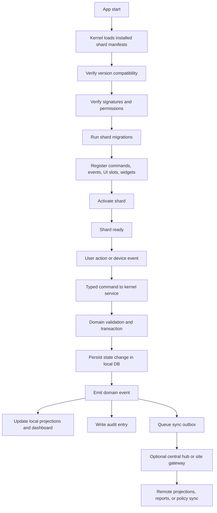
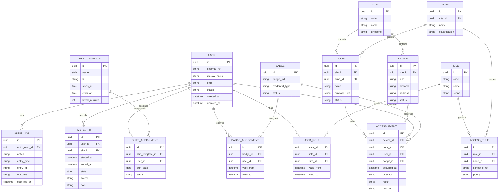

# TimeShards Deep Research Report

## Executive summary

TimeShards should be treated as a **modular desktop platform**, not as a single giant application. The core idea in your notes is already clear: a locally installed, cross-platform system for time tracking and access control, built around a small kernel with pluggable modules or “shards,” starting with a simple MVP and expanding into scheduling, approvals, absence, overtime, reporting, badges, zones, doors, and hardware integrations later. That is a sound direction because it keeps the first release small, while preserving a path to an enterprise-grade product without forcing everything into one monolith. fileciteturn0file0 fileciteturn0file1

The strongest build strategy is an **edge-first, local-first desktop system**: each installation or site should be able to work on its own local database, keep operating when the network is unreliable, and synchronize to a central service only when needed. That matches the core ideas of local-first software, where the local device holds the primary working copy and servers assist with synchronization, multi-device access, and coordination rather than acting as the only source of truth. SQLite is specifically well suited to local application data and offline-capable edge usage, while PostgreSQL is better when you need centrally shared state, stronger concurrency, or multi-site replication. citeturn24view1turn52view0turn52view2turn51view3

For the first version, the best default stack is **Tauri 2 + Rust core + Svelte frontend + SQLite local storage**, with an optional PostgreSQL sync hub for multi-site deployment. Tauri gives you a capability-based desktop security model, typed Rust commands, an event system, signed updates, and packaging paths across Windows, macOS, and Linux. Svelte is a strong fit for a compact desktop UI because it compiles components into optimized JavaScript and provides compile-time accessibility warnings. If the team is heavily JavaScript-oriented and wants the largest desktop ecosystem, Electron is still viable, but only if you follow its security guidance very strictly. citeturn48view1turn50view0turn50view1turn49view3turn37view1turn35view1turn36view0turn46view0turn47view0turn47view1turn47view2

The biggest risk is **not** the timer or the dashboard. The real complexity sits in identity, policy, synchronization, auditability, and hardware trust boundaries. Time tracking and physical access sound adjacent, but they should not be tightly coupled at the write path. A door event should not automatically mutate a timesheet. Instead, both domains should emit auditable events into a shared model so that later policies, dashboards, and exception rules can derive attendance or anomalies safely. That design choice is what will keep the product sane at scale. This is especially important if you later add AI: AI should explain anomalies, draft schedules, and summarize exceptions, but it should not directly decide payroll or unlock doors. That kind of automation must remain deterministic and auditable. citeturn20view0turn14view2turn14view3turn17academia4turn23academia0turn23academia1

The best commercial path is to make the **kernel and a few foundational shards open source**, then charge for enterprise modules, hardware bridges, hosted sync, compliance tooling, and support. If you want some protection against closed forks while still allowing commercial adoption, MPL-2.0 is a good default for the core because its copyleft is file-level rather than whole-program. If you want maximum permissiveness, Apache-2.0 is the business-friendly option and also includes a patent grant. AGPL is only the right choice if you explicitly want cloud operators of modified versions to publish source; that often limits adoption in B2B security software. citeturn26view0turn27view0turn27view1turn27view2turn27view3

## Product vision and scope

TimeShards should be positioned as a **workforce operations platform for small to mid-size organizations and multi-site operators** that need reliable local operation first, and central coordination second. The practical buyer set is obvious: operations managers, HR or office admins, security admins, and leadership who want usable dashboards without deploying a giant ERP. The product vision in your own material already supports exactly this staged expansion from timer and roles into deeper workforce and access workflows. fileciteturn0file0 fileciteturn0file1

A disciplined scope boundary is critical. The MVP should solve one complete problem extremely well: **capture working time, control who can do what, and show managers a basic live picture**. That means the kernel, identities, permissions, timer flows, and dashboard must be solid before the team touches payroll exports, advanced scheduling optimization, biometrics, or full door-controller fleets. NIST’s RBAC framing is a good fit here because it gives a standard vocabulary of users, roles, permissions, operations, and objects, which maps cleanly to TimeShards’ modular authorization model. citeturn20view0

### Product shape

The product should feel like one coherent application to users, but under the hood it should act like a **suite of bounded shards** sharing a trusted core. The kernel owns application boot, security, identity, storage, sync, audit, and update mechanisms. Each shard owns one domain: timer, users, dashboard, scheduling, badges, access events, reporting, and so on. That way the system can grow without creating a spaghetti codebase or a fragmented UX.

### MVP and later modules

| Domain area | MVP status | Purpose in first release | Later expansion |
|---|---|---|---|
| Timer | **In MVP** | Start, stop, pause, break, switch activity, notes, manual correction request | Rule-based rounding, kiosk mode, location/site assertions |
| Users and roles | **In MVP** | Local users, role templates, least-privilege permissions, admin setup | SSO, delegated admin, contractor identities, group sync |
| Basic dashboard | **In MVP** | Active timers, today/week totals, correction queue, simple exceptions | Cross-site analytics, heatmaps, labor cost views, AI summaries |
| Scheduling | Later | Not required to prove core value | Shift templates, assignments, coverage gaps, schedule publishing |
| Timesheets and approvals | Later | Defer until timer correctness is proven | Supervisor approval, payroll export, locked periods |
| Absence and leave | Later | Defer policy-heavy workflows | Leave requests, balances, approval chains |
| Overtime rules | Later | Defer legal/policy complexity | Rule engine, caps, alerts, local policy packs |
| Badges, zones, doors | Later | Requires hardware abstraction first | Zone policies, door groups, anti-passback, escort flows |
| Hardware integrations | Later | Start with simulator only | Serial/TCP bridges, SDK sidecars, controller adapters |
| Reporting and exports | Later | MVP only needs simple summaries | Custom reports, BI feeds, scheduled exports |
| Audit and privacy workflows | Later but foundational data model from day one | Model now, feature later | Retention rules, export/delete workflows, compliance packs |
| Admin workflows | Later | Start light | Bulk assignment, exception resolution, badge issuance, policy staging |
| AI assistance | Later | Only after audit and policy foundations exist | Suggestions, anomaly explanations, schedule drafts |

The technical reason for this priority order is simple: time capture, identity, security, and auditability are foundational. Reporting, policy engines, access hardware, and AI all become brittle if the base event model is weak. That is also consistent with local-first research: once many replicas, schema changes, and concurrent updates enter the picture, complexity rises quickly, so the first release should keep state transitions narrow and deterministic. citeturn24view1turn23academia0turn23academia1

### Recommended roadmap

The medium-term roadmap should unfold in layers rather than themes.

First, ship the **kernel + timer + users/roles + dashboard** as a complete local-first desktop product.

Next, add **managerial workforce control**: timesheets, approvals, scheduling, absence, and overtime rules.

Only after that, add **physical access and hardware**: badges, readers, zones, doors, device health, controller adapters.

Then add **enterprise hardening**: audit workflows, privacy tooling, retention policies, reporting, exports, and multi-site replication.

Finally, add **AI TimeShards** as an assistive layer across existing modules: anomaly explanations, policy suggestions, operator copilots, and natural-language reporting. AI should read from event logs and read models; it should not sit in the critical command path for payroll, identity, or door unlock decisions. That is a product decision as much as a technical one.

## Architecture and how the parts work together

The right architecture for TimeShards is a **controlled micro-kernel**, not a free-for-all plugin host. In the first releases, shards should be installed and activated only through trusted, versioned packages. The kernel should expose stable APIs, enforce permissions, run migrations, manage UI contributions, validate events, and keep an append-only operational log. Dynamic third-party extensibility should come later, once contracts are stable. Tauri’s command/event model and capability boundaries map well to this style of design. citeturn50view0turn50view1turn50view2turn48view1turn45view0

### Kernel responsibilities

The kernel should own exactly these concerns:

- boot and shard discovery
- signature and compatibility verification
- permissions and capability enforcement
- typed command routing
- event bus and event persistence
- database connections and migrations
- sync outbox/inbox
- session/authentication state
- audit logging
- updater integration
- UI shell, navigation, and slot registration

Everything else belongs in shards. If the kernel starts containing scheduling rules, badge policies, or timesheet approval logic, it will stop being a kernel and become a monolith.

### Shard lifecycle and event flow



This model keeps **commands** and **events** separate. Commands mutate state and are validated. Events describe facts that already happened. Tauri already distinguishes typed Rust commands from its event system, which is useful here, and CloudEvents gives a well-known envelope model for consistent event description across modules. JSON Schema is the right validation format for manifests, DTOs, and event payloads. citeturn50view0turn50view1turn50view2turn14view2turn14view3

### Module contract

A good shard contract should be schema-first and AI-friendly. That means the module API should be easy for humans and code assistants to reason about.

```ts
export interface ShardManifest {
  id: string;                  // e.g. "timeshards.timer"
  name: string;
  version: string;             // semver
  apiVersion: string;          // kernel contract version
  description?: string;
  dependencies?: string[];     // e.g. ["timeshards.users>=1.0.0"]
  permissions: string[];       // e.g. ["time.entry:write", "dashboard.widget:register"]
  migrations?: string[];
  ui?: {
    routes?: RouteContribution[];
    widgets?: WidgetContribution[];
    settingsPanels?: SettingsContribution[];
    navItems?: NavContribution[];
  };
  events?: {
    publishes?: string[];
    subscribes?: string[];
  };
}
```

```ts
export interface ShardRuntime {
  onInstall(ctx: InstallContext): Promise<void>;
  onMigrate(ctx: MigrationContext): Promise<void>;
  onActivate(ctx: ActivateContext): Promise<void>;
  onDeactivate(ctx: DeactivateContext): Promise<void>;
  onHealthCheck(ctx: HealthContext): Promise<HealthReport>;
}
```

The first implementation should keep shards **in-process and trusted**. Later, if you want a marketplace or partner-written modules, move to **WebAssembly components** with WIT contracts and a Wasmtime host. The WebAssembly component model is explicitly designed around interoperable components and WIT-defined contracts, which is exactly what you want for a sandboxed extension story. citeturn42view0turn42view1turn43view0

### UI slots and widget system

The UI should be composed through a **slot system**, not direct cross-module imports. That prevents modules from entangling each other’s rendering code.

Recommended slots:

| Slot | Intended use |
|---|---|
| `shell.nav.primary` | Main navigation items |
| `dashboard.widgets.primary` | Manager overview widgets |
| `dashboard.widgets.secondary` | Alerts, summaries, exceptions |
| `user.profile.tabs` | User-related module tabs |
| `admin.settings.sections` | Admin configuration |
| `entity.badge.sidepanel` | Contextual inspectors |
| `toolbar.actions.global` | App-level commands |
| `route.mounts.*` | Full pages owned by a module |

A widget contribution should declare a title, minimum role, preferred size, route dependencies, and a data provider contract. The kernel should decide final placement so modules can contribute without dictating layout.

### Storage, sync, and offline-first model

Use a **three-layer storage model**.

The first layer is the **local operational store**, usually SQLite, where validated writes happen and where the desktop app remains usable when offline. SQLite is explicitly suited to local application storage and can act as a client-side cache or edge datastore, which avoids network round-trips and allows continued operation during outages. It is the wrong choice for situations with a shared remote data file and many truly concurrent writers, where a client/server database is more appropriate. citeturn52view0turn52view2

The second layer is the **outbox/inbox replication layer**, which records events or commands waiting to be synchronized. This should be idempotent, cursor-based, and audit-friendly. Do not attempt a full CRDT strategy for every workflow. Timer entries, approvals, badge assignments, and access rules are policy-bearing records; they need deterministic conflict handling, not “best effort” merging. Local-first literature is useful here for understanding why offline-first is desirable, while also warning that schema change and decentralized consistency become difficult over time. citeturn24view1turn23academia0turn23academia1

The third layer is the **central coordination and analytics store**, usually PostgreSQL, for multi-site search, dashboards, long-term reporting, and centralized administration. PostgreSQL logical replication uses a publish/subscribe model, can replicate subsets of data, supports cross-version and cross-platform use cases, and is appropriate when you need centralized control with filtered data feeds. citeturn51view1turn51view3

### Data model



### Example schemas

These are implementation-ready starting points. They are not the only correct shapes, but they are clean, stable, and easy to validate.

#### User schema

```json
{
  "$schema": "https://json-schema.org/draft/2020-12/schema",
  "$id": "timeshards/user.schema.json",
  "title": "User",
  "type": "object",
  "required": ["id", "displayName", "status", "createdAt", "updatedAt"],
  "properties": {
    "id": { "type": "string", "format": "uuid" },
    "externalRef": { "type": ["string", "null"] },
    "displayName": { "type": "string", "minLength": 1, "maxLength": 200 },
    "email": { "type": ["string", "null"], "format": "email" },
    "siteIds": {
      "type": "array",
      "items": { "type": "string", "format": "uuid" },
      "default": []
    },
    "status": {
      "type": "string",
      "enum": ["active", "inactive", "suspended", "deleted"]
    },
    "createdAt": { "type": "string", "format": "date-time" },
    "updatedAt": { "type": "string", "format": "date-time" }
  },
  "additionalProperties": false
}
```

#### Shift assignment schema

```json
{
  "$schema": "https://json-schema.org/draft/2020-12/schema",
  "$id": "timeshards/shift-assignment.schema.json",
  "title": "ShiftAssignment",
  "type": "object",
  "required": ["id", "userId", "shiftDate", "startsAt", "endsAt", "timezone", "status"],
  "properties": {
    "id": { "type": "string", "format": "uuid" },
    "userId": { "type": "string", "format": "uuid" },
    "siteId": { "type": "string", "format": "uuid" },
    "shiftTemplateId": { "type": ["string", "null"], "format": "uuid" },
    "shiftDate": { "type": "string", "format": "date" },
    "startsAt": { "type": "string", "format": "date-time" },
    "endsAt": { "type": "string", "format": "date-time" },
    "breakMinutes": { "type": "integer", "minimum": 0, "default": 0 },
    "timezone": { "type": "string" },
    "status": {
      "type": "string",
      "enum": ["planned", "published", "completed", "cancelled"]
    }
  },
  "additionalProperties": false
}
```

#### Badge schema

```json
{
  "$schema": "https://json-schema.org/draft/2020-12/schema",
  "$id": "timeshards/badge.schema.json",
  "title": "Badge",
  "type": "object",
  "required": ["id", "badgeUid", "credentialType", "status"],
  "properties": {
    "id": { "type": "string", "format": "uuid" },
    "badgeUid": { "type": "string", "minLength": 1, "maxLength": 128 },
    "credentialType": {
      "type": "string",
      "enum": ["rfid", "nfc", "smartcard", "mobile", "pin", "unknown"]
    },
    "status": {
      "type": "string",
      "enum": ["active", "inactive", "revoked", "lost", "expired"]
    },
    "issuer": { "type": ["string", "null"] },
    "validFrom": { "type": ["string", "null"], "format": "date-time" },
    "validTo": { "type": ["string", "null"], "format": "date-time" }
  },
  "additionalProperties": false
}
```

#### Access event schema

```json
{
  "$schema": "https://json-schema.org/draft/2020-12/schema",
  "$id": "timeshards/access-event.schema.json",
  "title": "AccessEvent",
  "type": "object",
  "required": ["id", "occurredAt", "deviceId", "result", "direction"],
  "properties": {
    "id": { "type": "string", "format": "uuid" },
    "occurredAt": { "type": "string", "format": "date-time" },
    "siteId": { "type": ["string", "null"], "format": "uuid" },
    "deviceId": { "type": "string", "format": "uuid" },
    "doorId": { "type": ["string", "null"], "format": "uuid" },
    "zoneId": { "type": ["string", "null"], "format": "uuid" },
    "userId": { "type": ["string", "null"], "format": "uuid" },
    "badgeId": { "type": ["string", "null"], "format": "uuid" },
    "direction": {
      "type": "string",
      "enum": ["entry", "exit", "unknown"]
    },
    "result": {
      "type": "string",
      "enum": ["granted", "denied", "forced", "doorHeld", "tamper", "error"]
    },
    "reasonCode": { "type": ["string", "null"] },
    "rawRef": { "type": ["string", "null"] },
    "rawPayload": { "type": ["object", "null"] }
  },
  "additionalProperties": false
}
```

## Technology choices and deployment

The strongest default is **Rust across the trusted core**, with the frontend in a mainstream web framework. Rust gives you a good foundation for hardware interaction, database logic, background tasks, and safe desktop command handling. Tauri’s official model already assumes Rust services behind a web UI, with commands for request/response work and events for looser signaling. SQLx is the best default data access layer if you want async queries and support for both SQLite and PostgreSQL. Diesel is the better fit if you want heavier compile-time guarantees and a more structured ORM/query builder. citeturn50view0turn50view1turn45view0turn40view0turn41view0turn41view2

### Stack options and recommendation

| Layer | Recommended default | Strong alternative | Why the default wins |
|---|---|---|---|
| Desktop shell | **Tauri 2** | Electron | Better fit for a Rust-first secure core with capabilities, signed updates, and narrower desktop surface |
| Frontend | **Svelte 5** | React 19 | Svelte is simpler to keep lean and includes compile-time a11y warnings; React wins if you need the broadest ecosystem |
| Core language | **Rust** | TypeScript/Node for non-critical services | Better for trusted system code, hardware, local DB, background workers |
| Local DB | **SQLite** | — | Ideal for local-first desktop and edge-site operation |
| Central DB | **PostgreSQL** | — | Best for multi-site shared state, replication, and analytics |
| Query layer | **SQLx** | Diesel | SQLx is simpler for mixed SQLite/Postgres and async services |
| Extension sandbox later | **Wasm components + Wasmtime** | Separate sidecar processes | Best route for partner-written shards once APIs stabilize |

The factual basis for this recommendation is straightforward. Tauri provides typed Rust commands, an event model, a fine-grained capability boundary around IPC, signed update verification that cannot be disabled, and official packaging guidance across platforms. Svelte compiles components into tightly optimized JavaScript and surfaces accessibility issues at compile time. React remains a solid option because of its component model and extremely broad ecosystem. Electron has a mature multi-process model and built-in update support, but its own security checklist makes clear how much hardening is required, especially if any remote content is involved. citeturn50view0turn50view1turn48view1turn49view3turn37view1turn35view1turn36view0turn35view4turn46view0turn47view0turn47view1turn47view2turn38view3

### Tauri versus Electron

Tauri should be your default unless the team is overwhelmingly more comfortable with Electron and JavaScript-only desktop development.

| Question | Tauri answer | Electron answer |
|---|---|---|
| Trusted core and system integration | Strong fit through Rust commands, capabilities, and plugins | Strong fit, but more manual hardening |
| Update model | Strong signed updater flow | Mature autoUpdater flow with Squirrel metadata |
| Security posture | Good least-privilege story via capabilities and blocked dangerous plugin commands by default | Secure only if you actively enforce checklist items |
| JS ecosystem familiarity | Good, but more Rust involved | Excellent |
| Long-term plugin sandbox path | Good match with future Wasm host strategy | Possible, but less natural for Rust-first contracts |

If you choose Electron instead, you must treat the security checklist as mandatory: HTTPS/WSS only, no Node integration in remote content, context isolation enabled, process sandboxing enabled, strict IPC sender validation, and no `shell.openExternal` with untrusted input. Electron’s own documentation is explicit on these points. citeturn47view0turn47view1turn47view2turn47view3

### Database and deployment choices

| Scenario | Best local store | Best central store | Notes |
|---|---|---|---|
| Single office, few admins | SQLite | None required | Simplest deployment, local backup/export |
| Single site with remote manager visibility | SQLite | Small Postgres hub | Use outbox sync and dashboard projections |
| Multi-site enterprise | SQLite per site/edge node | PostgreSQL | Most realistic serious deployment pattern |
| Experimental distributed SQLite cluster | SQLite + LiteFS | Optional | Advanced path only; caution warranted |
| Backup-heavy small deployment | SQLite + Litestream backups | Optional | Good for disaster recovery, not shared concurrency |

SQLite is ideal for local application and edge-site storage, but it is not meant to compete with a centralized multi-writer enterprise database. SQLite’s own documentation is explicit that it solves a different problem from a shared client/server repository and only supports one writer at a time per database file. PostgreSQL logical replication, by contrast, supports publication/subscription, transactional ordering, and selective replication scenarios across sites and versions. LiteFS can transparently replicate SQLite databases, but Fly’s own documentation says to use it with caution and maintain off-site backups. Litestream is a cleaner answer when the goal is SQLite backup and point-in-time recovery rather than distributed writes. citeturn52view2turn51view1turn51view3turn39view0turn39view1

### Packaging, installers, updates, and CI

The deployment target should be **native desktop installers first**, then managed fleet distribution later. Tauri’s official docs already cover AppImage, Debian, DMG, RPM, and Windows Installer packaging; its GitHub pipeline guide shows matrix builds and release automation; and its updater requires signatures verified with a configured public key. Tauri also documents separate updater artifacts for Windows MSI and NSIS, macOS bundles, and Linux AppImages. Electron’s update story is also mature, but its metadata formats differ by platform and rely on Squirrel conventions. citeturn37view1turn49view3turn38view0turn38view1turn38view3

Recommended release strategy:

| Platform | Installer strategy | Update strategy |
|---|---|---|
| Windows | NSIS for user installs, MSI for corp deployment | Signed in-app updater, passive mode default |
| macOS | DMG / app bundle with signing and notarization | Signed updater artifacts |
| Linux | AppImage for direct installs, DEB/RPM for managed environments | In-app updater for AppImage channel, package-manager updates for DEB/RPM |

For CI/CD, use a GitHub Actions matrix that runs linting, unit tests, contract tests, DB migration tests, E2E desktop tests, package signing, and release creation across Windows, macOS, and Linux. Tauri’s GitHub guide already shows the Rust/Node cache pattern and cross-platform build matrix you want as a starting point. citeturn37view1turn37view2

A practical testing pyramid should look like this:

- unit tests for time calculations, RBAC checks, and policy evaluation
- contract tests for commands, events, and schemas
- migration tests on SQLite and PostgreSQL
- desktop UI tests with WebDriver
- hardware simulator tests for reader/controller event ingestion
- release smoke tests on all target OSes

## Security, compliance, hardware, and scale

TimeShards handles time records, badge assignments, access events, and potentially sensitive staff metadata. That makes the security model non-negotiable. The kernel should assume the frontend is less trusted than the core, hardware adapters are less trusted than domain services, and AI is less trusted than audited rules. Tauri’s capability system, permission-gated plugin access, and signed updater give you a solid root of trust on the desktop side. Electron can do the job too, but only if you explicitly maintain isolation boundaries. citeturn48view1turn45view0turn49view3turn47view0turn47view1turn47view2

### Authentication, authorization, and secrets

Use **RBAC as the baseline**, with optional context conditions layered on top later. Core identity concepts should be users, roles, permissions, sites, and sessions. Roles should be coarse and human-meaningful, such as employee, supervisor, HR admin, security admin, and system admin. Permissions should be fine-grained and namespaced by shard. NIST’s RBAC material remains the right conceptual base because it standardizes users, roles, permissions, operations, and objects, and it also covers role hierarchies and constraints such as separation of duties. citeturn20view0

For secrets, avoid putting anything sensitive directly in frontend state or plain config files. Store long-lived secrets, keys, and protected tokens in a dedicated secret store. Tauri’s Stronghold plugin uses the IOTA Stronghold engine and supports Argon2-based initialization patterns, which makes it a useful default for protected local secret material. Separately, Tauri’s updater requires signature verification with a public key bundled in configuration and a private signing key held in the release environment; that is exactly the kind of separation you want for release trust. citeturn44view0turn49view3

### Auditability and privacy

You should design for **privacy by design**, not bolt it on later. Local workforce time data, access logs, and anything connected to badge or video workflows can become personal data with compliance implications, especially if the product later links access control with video, biometrics, or behavior analysis. The practical engineering answer is to keep the data model minimal, separate identifiers from optional HR metadata, add retention classes from the beginning, and make export, correction, and deletion workflows explicit. EDPB guidance on video devices and broader privacy-by-design research both point in the same direction: traceability, minimization, and design-time controls matter more than vague policy documents after the fact. citeturn14view1turn17academia4turn17academia0turn17academia2

That means every privileged command should produce an audit record with at least: actor, action, target entity, timestamp, site, outcome, correlation ID, and before/after metadata where relevant. Keep a separate **audit log** from the domain event stream. The event stream explains what happened in the business domain. The audit log explains who did what in the system and under what authority.

### Hardware integration pattern

The safest integration strategy is a **three-step progression**.

First, build a **simulator shard** that behaves like readers, doors, and controllers over synthetic or recorded event streams. This will unstick development immediately.

Second, add **protocol adapters** for serial, TCP, or vendor SDK sidecars. These adapters should run behind a narrow interface and emit normalized access events into the kernel.

Third, add **production device management**: provisioning, health checks, policy sync, diagnostics, and firmware-awareness.

Do not let every hardware driver write directly into business tables. Device adapters should only submit validated commands or normalized events. That keeps the trust boundary clean.

### Reader and controller security

For physical access, prefer **OSDP-based reader/controller communication** over legacy assumptions whenever possible. SIA’s OSDP standard was created to improve interoperability in access control products, is now an IEC standard, and is recommended by SIA for installations requiring real security or higher-security government settings. HID’s OSDP material also highlights bidirectional communication, central configuration, and secure communication protocol support as meaningful security and operations advantages. citeturn30view0turn31view0turn31view1

At the system level, the secure default should be:

- per-device credentials or keys
- signed or checksum-verified config bundles
- isolated controller network segment
- explicit device inventory and health status
- offline controller behavior defined per site
- clock synchronization and monotonic event ordering
- deny-by-default rules when policy state is inconsistent

If you later add biometrics, video-linked access verification, or visitor identity proofs, treat them as separate regulated modules rather than augmenting the badge shard casually.

### Performance and multi-site scaling

The right scaling model is **site-local writes, central read-sharing**. Each site should have a local write path for timers, attendance adjustments, badges, and access events. Central services should aggregate, replicate, and project that data outward.

A good multi-site model looks like this:

| Pattern | Good for | Weakness |
|---|---|---|
| Standalone desktop only | Single site, low complexity | No centralized visibility |
| Desktop + central sync API | Small distributed orgs | Requires conflict discipline |
| Site gateway + central hub | Multi-site operations with devices | More moving parts |
| Fully centralized writes | Only when always-online is realistic | Weak offline resilience |

PostgreSQL warm standby and logical replication both help on the central side: warm standby supports HA and read-only standby use cases, while logical replication supports publish/subscribe replication and filtered data distribution to subscribers. On the edge side, SQLite remains the right local write store, precisely because it is fast, local, and independent of a round-trip to a remote shared server. citeturn39view2turn51view1turn51view3turn52view0turn52view2

## Delivery plan, developer experience, and commercial model

A project like this should not begin with “start coding features.” It should begin with **contracts, scaffolding, and ruthless boundaries**. That is especially true if you want to build with “vibe coding” or heavy AI assistance. AI helps most when the repository structure is explicit, schemas are canonical, interfaces are versioned, and the happy path is scripted.

### Developer workflow and scaffold

Use a monorepo with a structure similar to this:

```text
/apps
  /desktop
  /sync-hub
/crates
  /kernel
  /auth
  /audit
  /events
  /storage-sqlite
  /storage-postgres
/shards
  /timer
  /users
  /dashboard
  /simulator-access
/packages
  /schemas
  /sdk-ts
  /design-tokens
/docs
  /adr
  /contracts
  /playbooks
```

Every shard should be generated from a scaffold command that creates:

- manifest
- command contract
- event contract
- DB migration files
- UI slot registration
- test skeletons
- mock data
- documentation page
- compatibility declaration against kernel API version

That kind of structure does two things at once: it speeds up developers, and it makes AI-generated code much less likely to drift into random patterns.

### Versioning and governance

Version three things separately:

- **kernel API version**
- **shard version**
- **data schema version**

The hard rule should be: a shard may depend only on stable contracts published by the kernel or another explicitly exported shard API. No private cross-imports. No hidden DB table assumptions. No “just call this function from another module.”

Adopt a lightweight governance model early:

| Governance area | Rule |
|---|---|
| Architecture decisions | Short ADR required for cross-cutting changes |
| API changes | Schema diff + compatibility note mandatory |
| Permissions | Every new permission reviewed like a security change |
| Migrations | Forward and rollback story documented |
| Release gates | No release without migration test, audit test, and package smoke test |
| Third-party shards | Not before stable API v1 and signed package format |

### Phases, milestones, and effort

The effort estimates below assume **unknown budget and team size**, so they are intentionally heuristic. A realistic working assumption is a core team of 4–6 engineers, with part-time design and QA support.

| Phase | Outcome | Estimated effort |
|---|---|---|
| Foundation and architecture | Kernel contracts, scaffold, CI, schema registry, design system seed, simulator shell | 2–3 person-months |
| MVP build | Timer, users/roles, sessions, dashboard, local SQLite, audit base, desktop packaging | 5–7 person-months |
| Workforce workflows | Timesheets, approvals, scheduling basics, absence base, overtime rule engine seed | 6–9 person-months |
| Access control expansion | Badge model, zone/door model, device simulator, first protocol bridges, event normalization | 8–12 person-months |
| Enterprise hardening | Multi-site sync, reporting, retention, privacy workflows, admin tooling, support playbooks | 5–8 person-months |
| AI layer | Explainability, anomaly review, schedule suggestions, admin copilot | 3–5 person-months |

A credible first commercial version is therefore in the range of roughly **13–19 person-months** for the kernel + MVP + enough hardening to deploy seriously, and **26–39 person-months** for a broader platform with hardware and enterprise workflows. Those are not promises. They are planning estimates.

### Main risks and mitigations

| Risk | Why it matters | Mitigation |
|---|---|---|
| Overengineering the plugin system too early | Delays product without proving value | Keep v1 shards trusted and in-process |
| Offline sync complexity | Easy source of subtle bugs and policy conflicts | Use command/outbox model; avoid general-purpose merging |
| Hardware diversity | Vendor behavior will vary and consume time | Build simulator first; normalize events; adapter boundary |
| Compliance ambiguity | Time and access data can become sensitive quickly | Privacy-by-design defaults; retention and export modeled early |
| Role explosion | RBAC becomes messy fast in real orgs | Start with role templates + scoped permissions + site binding |
| AI misuse | Unsafe automation can break trust | Keep AI read-only or recommendation-only in early phases |
| Schema drift | Fast iteration can fracture shards | Contract-first schemas and migration tests mandatory |

### License and business model options

| Core license option | Good for | Main trade-off |
|---|---|---|
| **MPL-2.0** | Open core with some protection against closed forks | More obligations than Apache, but still commercially workable |
| **Apache-2.0** | Maximum commercial and partner friendliness | Easier for competitors to repackage |
| **AGPL-3.0** | Forcing modified hosted versions to publish source | Can reduce enterprise adoption sharply |

Mozilla’s FAQ describes MPL-2.0 as a file-level copyleft that still allows larger works under other licenses. Apache-2.0 provides broad copyright and patent grants. AGPL is explicitly designed to ensure modified network server software makes source available to remote users. citeturn26view0turn27view0turn27view2turn27view3

The best business model fit here is usually:

- **open-source kernel + official core shards**
- **paid enterprise shards** for reporting, compliance, workflow automation, and hardware bridges
- **paid support and onboarding**
- **optional hosted sync/control plane**
- **on-prem enterprise offering** for security-sensitive buyers

That model matches the market reality of time/access products: the value is not just code, it is deployment confidence, hardware support, policy correctness, and operational reliability.

### Concise implementation checklist

1. Lock the kernel contract: manifest schema, command schema, event envelope, permission format.  
2. Build the monorepo scaffold and shard generator.  
3. Implement kernel boot, manifest validation, permission enforcement, and migrations.  
4. Ship SQLite local store with strict schemas and append-only event/audit tables.  
5. Build Users/Roles shard and session/auth flow.  
6. Build Timer shard with correction flow and clean state machine.  
7. Build Basic Dashboard shard from read projections, not direct table queries.  
8. Add package signing, updater, CI matrix, and installer smoke tests.  
9. Add simulator-access shard before touching real hardware.  
10. Define sync outbox/inbox contracts before building multi-site features.  

### First eight-week sprint plan

| Week | Goal | Deliverable |
|---|---|---|
| Week one | Architecture lock | ADRs, schemas, repo structure, coding standards |
| Week two | Kernel bootstrap | App boot, manifest loader, permissions, shard registration |
| Week three | Local storage base | SQLite schema, migrations, audit log, event store |
| Week four | Identity base | Users, roles, sessions, admin bootstrap |
| Week five | Timer core | Start/stop/break/switch flows, notes, validation |
| Week six | Dashboard base | Live widgets, projections, exception list |
| Week seven | Packaging and release | GitHub Actions, signed builds, updater, installers |
| Week eight | Hardening and proof | Demoable MVP, test coverage, docs, backlog for phase two |

At the end of eight weeks, the target is **not** a “complete workforce platform.” The target is a serious, installable alpha that proves the kernel, local-first model, permissions, timer flows, and dashboard projections all work together on real desktops.

### Open questions and limitations

A few important product decisions are still unknown and materially affect architecture depth:

- which access hardware vendors or protocols matter first
- whether SSO is required in the first paying deployment
- whether payroll export is required early or can stay out of scope
- which jurisdictions drive overtime and absence rules
- whether the first real customers prefer standalone on-prem or centrally managed multi-site deployment
- whether “AI TimeShards” means embedded assistant UX, background analytics, or both

Those unknowns do **not** change the recommended foundation. They mainly affect how soon you need the sync hub, rule engine depth, and hardware adapter surface.