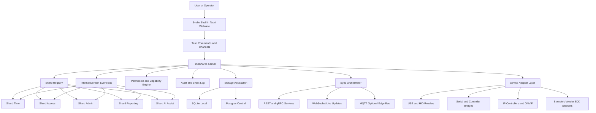
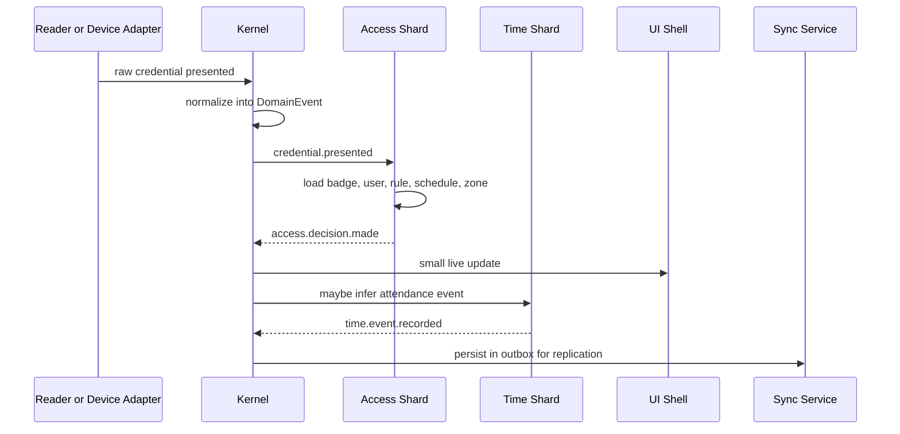
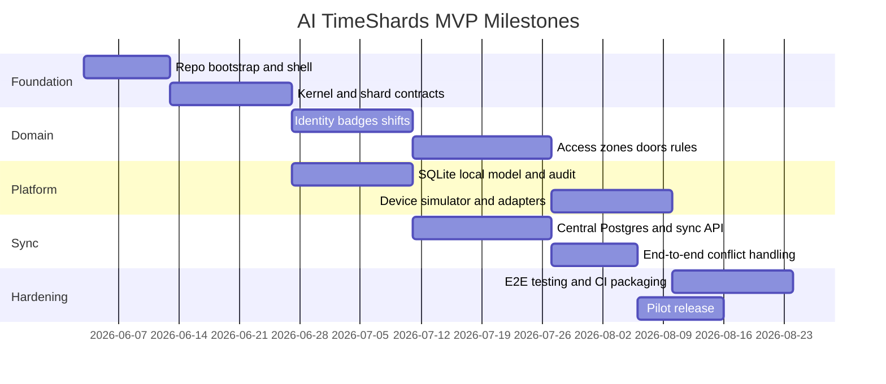

# AI TimeShards Research Report

## Executive Summary

The existing project material already points in a clear direction: a Primion-inspired desktop product organized around **Time**, **Access**, and **Admin**, implemented as a small central core with pluggable feature shards, role-aware dashboards, and modular widgets. That vision is coherent and buildable. The right interpretation is **not** “an operating-system kernel,” but **an application micro-kernel**: a small trusted core that owns lifecycle, permissions, events, storage abstraction, sync, audit, and UI composition, while business features live in isolated modules. fileciteturn0file0 fileciteturn0file1 citeturn44view0

The highest-confidence build path is: **Tauri 2 + Rust kernel + Svelte 5 / SvelteKit SPA shell + SQLite on each workstation/terminal + central Postgres + outbox-based sync service**. That choice matches Tauri’s architecture around Rust plus an OS webview, SvelteKit’s SPA/static-adapter requirements for Tauri, SQLite’s strengths for local edge storage, and PostgreSQL’s strengths for centralized multi-user data and replication. citeturn44view0turn27view0turn47view1turn48view1turn49view0turn49view1

One design decision matters more than anything else: **do not use the frontend bridge as the system bus**. Tauri commands are good for typed request/response calls, and Tauri events are good for small UI notifications, but Tauri’s own docs say events are JSON-string payloads and are not designed for low-latency or high-throughput streaming. The kernel therefore needs its own internal Rust event bus, with Tauri commands, channels, and events used only at the shell boundary. citeturn46view0turn46view1turn45view0

The recommended MVP is narrow on purpose: identity and roles, users and badges, shifts and schedules, clock-in/out, zone and door permissions, live access events, timesheets, audit logs, offline local operation, and one simulated plus one real adapter path. That is enough to prove the full architecture end to end without getting trapped in premature enterprise scope. ONVIF’s access-control profiles also make it realistic to support IP-based access-control devices in a standards-aligned way rather than hard-wiring every vendor from day one. citeturn21view0turn22view0turn22view4

From a compliance perspective, the system is viable if built with **privacy by design** and **least privilege** from the first commit. GDPR Article 5 requires minimization, purpose limitation, storage limitation, and integrity/confidentiality; Article 25 requires data protection by design and by default; Article 32 requires appropriate technical and organizational measures and regular testing; Article 35 requires a DPIA for high-risk processing; and biometric data used to uniquely identify a person is a special category under Article 9. That means raw biometric templates should be avoided unless there is a concrete legal basis and a hard requirement to store them. citeturn32view1turn34view0turn34view2turn34view3turn34view4turn34view1

Packaging and release are straightforward with Tauri: Windows installers, macOS bundles/DMG, and Linux AppImage, Debian, and RPM are all supported in the official docs; Tauri also provides an updater plugin and GitHub release pipeline guidance. macOS signing is effectively required for sane distribution, Windows signing is strongly recommended to avoid SmartScreen pain, and Linux signing is optional but increases trust. citeturn26view1turn46view2turn36view0turn37view0turn37view1turn37view3

## Stakeholder Explanation

AI TimeShards is easiest to understand as **one desktop app that acts like a front desk, a time clock, a security desk, and an admin office at the same time**. The center of the app is a small “traffic controller.” Around it, you plug in feature packs called **shards**. One shard tracks working time. Another decides whether a badge can open a door. Another handles admin tasks, reports, and audits. The user only sees the pieces they are allowed to use. fileciteturn0file0 fileciteturn0file1

In plain words, the end goal is this: when someone arrives, presents a badge, enters a door, starts a shift, ends a shift, or changes a schedule, the system should treat all of that as one connected story rather than separate tools. A single event can update access history, attendance, timesheets, live dashboards, and audit records at once. That is the real value: **one source of truth instead of disconnected software islands**. This is also exactly the kind of model that ONVIF’s access-control profiles assume for IP-based systems: a client that stores credentials, schedules, and access rules, and peripherals that send identity requests and receive grant/deny decisions. citeturn22view0turn22view4

The “AI” part should not start as magic automation. That is the wrong first move. In the first useful version, AI should be **assistive**: explaining a policy, flagging a suspicious access pattern, suggesting a missing punch correction, grouping anomalies, or helping an operator search logs faster. Let it explain and suggest before it decides. That keeps the product safer, easier to trust, and much easier to audit. This is a design recommendation grounded in the fact that the platform will already have structured events, audit history, and role-based workflows from the kernel design. citeturn34view1turn34view2

## Reference Architecture

The right architecture is a **trusted kernel** plus **business shards** plus **device/sync adapters**. Tauri is the desktop shell and system bridge. Svelte is the UI shell. Rust is where the kernel lives. SQLite gives every node or terminal a fast local database. Postgres acts as the central authority when multi-user coordination, reporting, and replication matter. Tauri’s own architecture is explicitly composable, uses Rust plus a webview, and exposes system integration through message passing, which fits this pattern well. citeturn44view0turn27view0turn48view1turn49view0



The kernel should own these responsibilities:

| Kernel concern | What it does | Why it belongs in the kernel |
|---|---|---|
| Shard lifecycle | Register, validate, start, stop, health-check shards | Modules stay replaceable without becoming the architecture |
| Permission graph | Decide which shard, command, widget, route, and device feature is allowed | Tauri already has a permissions/capabilities model per window/webview; your app should mirror that at the business layer citeturn13view3turn13view0 |
| Canonical event bus | Normalize all business and hardware events into one event format | Prevents device logic from leaking into UI or timesheet code |
| Storage abstraction | Offer repository interfaces over SQLite and Postgres | Lets the same workflow run locally or centrally |
| Sync orchestration | Persist outbox/inbox, conflict handling, replay | Offline-first becomes a core property, not an afterthought |
| Audit engine | Write append-only audit records for every privileged action | Needed for accountability, forensic review, and GDPR records of processing citeturn34view1turn34view2 |
| UI composition registry | Decide which widgets mount into which slots for which role | Keeps the shell stable while shards evolve |

The most practical shard model is **build-time pluggable, runtime enable/disable**. In other words: compile shards into the app or into signed sidecars, then activate them by manifest and license/config. Do **not** optimize for arbitrary third-party binary injection as the first extension mechanism. That makes security, compatibility, and support much worse. If true external extensibility is needed later, expose it through **process boundaries** with gRPC, REST, MQTT, or WebSocket rather than unrestricted in-process code loading. gRPC’s model of typed service definitions through Protocol Buffers fits that especially well for trusted sidecars and hardware bridges. citeturn14view2turn15view2turn14view0

A practical shard contract can look like this:

```rust
pub trait Shard {
    fn manifest(&self) -> ShardManifest;
    async fn setup(&mut self, ctx: KernelContext) -> Result<()>;
    async fn start(&mut self) -> Result<()>;
    async fn handle_command(&self, cmd: KernelCommand) -> Result<KernelReply>;
    async fn on_event(&self, event: DomainEvent) -> Result<()>;
    async fn stop(&mut self) -> Result<()>;
}
```

```json
{
  "id": "shard.access.live",
  "version": "0.1.0",
  "requires": ["core.identity", "core.audit"],
  "permissions": ["access.events.read", "zones.read", "doors.control"],
  "commands": ["access.live.list", "access.live.grantOverride"],
  "subscribes": ["credential.presented", "door.state.changed"],
  "publishes": ["access.decision.made", "alarm.raised"],
  "widgets": [
    {
      "slot": "dashboard.center",
      "component": "AccessLiveBoard",
      "minRole": "security_operator"
    }
  ]
}
```

The event bus should use a **canonical event envelope** and a **two-tier transport model**. Inside Rust, use a bounded multi-producer, multi-consumer queue; `tokio::sync::broadcast` is a good default because each sent value is seen by all consumers, with explicit lag detection when a consumer falls behind. At the shell edge, use Tauri commands for typed request/response and Tauri events or channels for UI notifications or moderate streaming. Tauri explicitly states that events are best for small payload streaming and multi-producer/multi-consumer patterns, but not for low-latency or high-throughput transport. citeturn45view0turn46view0turn46view1

A good canonical event envelope:

```ts
type DomainEvent<T = unknown> = {
  event_id: string
  event_type: string
  stream: string
  tenant_id?: string
  actor_id?: string
  device_id?: string
  correlation_id?: string
  causation_id?: string
  occurred_at: string
  schema_version: number
  payload: T
}
```

The UI shell should be **slot-based**. That means the shell defines stable mounting points, and shards contribute widgets into those points. Suggested slots: `nav.primary`, `dashboard.header`, `dashboard.center`, `dashboard.right`, `entity.sidebar`, `entity.tabs`, `live.feed`, `admin.panel`, `tray.quick_actions`. This gives you a stable “product skeleton” even when modules change. Svelte is a strong fit because it compiles declarative components into lean JavaScript, and Svelte’s `$state` rune gives straightforward reactive state without heavy boilerplate. For Tauri, SvelteKit should run in SPA/static mode with `adapter-static` and SSR disabled where direct access to Tauri APIs is needed. citeturn47view1turn47view0turn27view0turn27view2

A simple shell mockup could look like this:

```text
┌ AI TimeShards ─────────────────────────────────────────────────────────────────────┐
│ Search ▢   Site: HQ Berlin   Status: Connected   Alerts: 2   Sync: 14 pending     │
├───────────────┬───────────────────────────────────────┬────────────────────────────┤
│ Navigation    │ Dashboard Center                      │ Live / Exceptions          │
│               │                                       │                            │
│ Home          │ [Attendance today] [Doors online]     │ Unauthorized access        │
│ Time          │ [Late arrivals]   [Open alarms]       │ Reader offline             │
│ Access        │                                       │ Missing checkout           │
│ Admin         │ Shift board / Live board / Widgets    │                            │
│ Reports       │                                       │ Recent events timeline     │
│ Devices       │                                       │                            │
├───────────────┴───────────────────────────────────────┴────────────────────────────┤
│ Context Bar: User | Badge | Shift | Zone | Door | Audit | Sync | Integrations     │
└─────────────────────────────────────────────────────────────────────────────────────┘
```

For visual inspiration only, not as architecture authority, a generic access-control dashboard concept and a mainstream time-tracking layout are useful references for shell proportions and navigation density. citeturn41image9turn41image6

## Data Model and Workflows

The domain model should be event-friendly and boring. That is a compliment. You want durable IDs, immutable history, explicit validity windows, and the ability to reconstruct who did what, where, and why.

| Entity | Core fields | Purpose |
|---|---|---|
| `users` | `id`, `external_ref`, `person_no`, `name`, `email`, `status`, `employment_type`, `primary_role_id` | Human identity and employment context |
| `roles` | `id`, `name`, `permissions_json` | App-level authorization model |
| `badges` | `id`, `user_id`, `credential_uid`, `format`, `issued_at`, `revoked_at`, `status` | Physical or mobile credential lifecycle |
| `biometric_refs` | `id`, `user_id`, `vendor_template_ref`, `device_scope`, `status` | Reference to biometric enrollment without storing raw templates if avoidable |
| `sites` | `id`, `name`, `timezone`, `address` | Physical top-level locations |
| `zones` | `id`, `site_id`, `name`, `risk_level` | Logical access areas |
| `doors` | `id`, `zone_id`, `controller_id`, `name`, `direction`, `status` | Controlled entry points |
| `controllers` | `id`, `site_id`, `adapter_kind`, `address`, `firmware`, `health` | Device abstraction root |
| `readers` | `id`, `door_id`, `controller_id`, `reader_type`, `adapter_kind`, `health` | Credential capture devices |
| `access_rules` | `id`, `subject_type`, `subject_id`, `zone_id`, `schedule_id`, `valid_from`, `valid_to`, `mode` | Policy deciding who can enter where and when |
| `schedules` | `id`, `name`, `timezone`, `rule_json` | Reusable working and access windows |
| `shifts` | `id`, `user_id`, `schedule_id`, `planned_start`, `planned_end`, `site_id`, `state` | Planned work sessions |
| `time_events` | `id`, `user_id`, `event_type`, `source`, `device_id`, `occurred_at`, `confidence`, `correlation_id` | Raw attendance-relevant punches or inferred events |
| `timesheets` | `id`, `user_id`, `period_start`, `period_end`, `work_minutes`, `break_minutes`, `overtime_minutes`, `approval_state` | Approved payroll-facing aggregates |
| `access_events` | `id`, `user_id`, `credential_id`, `door_id`, `zone_id`, `decision`, `reason_code`, `occurred_at` | Every access attempt and decision |
| `audit_logs` | `id`, `actor_id`, `action`, `entity_type`, `entity_id`, `before_json`, `after_json`, `ip_or_device`, `occurred_at`, `hash_prev`, `hash_self` | Tamper-evident business audit |
| `sync_outbox` | `id`, `stream`, `event_json`, `state`, `attempts`, `next_retry_at` | Durable local-to-central delivery |
| `sync_inbox` | `id`, `source`, `event_id`, `applied_at`, `status` | Idempotent remote event application |

The main data rule is this: **store raw facts first, derived summaries second**. A clock-in button press, a badge presentation, a door-open command, and a manager approval are facts. A daily worked-hours total or unauthorized-access summary is derived data. That keeps corrections, audits, replay, and analytics sane.

A representative access workflow looks like this:



A representative time workflow should be equally strict: a user clocks in, the system records a `time_event`, attempts to attach it to the best matching `shift`, recomputes a draft `timesheet`, and creates an operator-visible exception if ambiguity remains. Never hide uncertainty. When the system is unsure, it should create a review task, not invent the truth.

For access control, adopt ONVIF concepts wherever IP devices support them. Profile C covers site information, door access control, and event/alarm management. Profile A adds credential, schedule, and access-rule configuration. Profile D covers access-control peripherals such as token readers, biometric readers, cameras, keypads, sensors, locks, displays, and LEDs, and assumes a client or controller makes the secure decision and sends grant or deny actions back. That maps extremely well to a kernel-plus-adapter design. citeturn21view0turn22view0turn22view4

For biometrics, the default position should be conservative: if a vendor device can store templates on-device and expose only verification outcomes or opaque template references, prefer that. GDPR Article 9 treats biometric data used for unique identification as a special category, which sharply raises the compliance burden. citeturn34view4

## Technology Choices and Integrations

The frontend/runtime comparison is not subtle. Tauri is the best fit here unless you have a hard reason to need a fully native widget toolkit.

Before the table, the key source-backed facts are these: Tauri uses Rust plus the OS webview and can ship a very small desktop app because it uses the system webview rather than bundling a runtime; Electron embeds Chromium and Node.js in the binary; Flutter compiles native Windows, macOS, and Linux desktop apps and supports plugins; Qt Quick gives a QML and C++ API for rich desktop UIs. citeturn44view0turn42view0turn43view1turn43view2

| Choice | Strengths | Weaknesses | Fit for AI TimeShards |
|---|---|---|---|
| **Tauri + Svelte** | Small distribution footprint, strong Rust backend, web-speed UI work, official SvelteKit guidance for Tauri, strong permissions/capabilities model citeturn44view0turn27view0turn13view3 | Webview differences across OSes; complex native plugins still require Rust work | **Recommended** |
| Electron + React/Svelte | Huge ecosystem, very familiar web model, mature tooling citeturn42view0 | Larger footprint because Chromium and Node.js are bundled; broader attack surface | Good fallback, not first choice |
| Flutter Desktop | Native desktop build targets and plugin support citeturn43view1 | Less natural for Rust-centric kernel, weaker fit for web-style desktop dashboards with embedded vendor tooling | Plausible, but not the sharpest fit |
| Qt Quick | Rich desktop UI system with QML + C++ APIs citeturn43view2turn43view3 | Higher complexity, steeper native-tooling burden, less “vibe coding” friendly for a web-first team | Strong enterprise option, slower to iterate |

The storage and sync comparison is also clear once you separate **edge** from **center**. SQLite is excellent for local app data, edge devices, caches, and offline operation. SQLite’s own guidance explicitly positions it as local storage for applications/devices, edge use, application file format, and cache for enterprise data; WAL gives concurrency between readers and writers but only on the same host and not over network filesystems. PostgreSQL is the better central authority for multi-user replication, permissions, and server coordination; logical replication gives publication/subscription with fine-grained control, while streaming replication keeps hot standbys close to the primary. citeturn48view1turn48view0turn49view0turn49view1

| Choice | What it solves | Caveat | Recommendation |
|---|---|---|---|
| **SQLite local only** | Single terminal, kiosk, standalone site, excellent offline behavior citeturn48view1turn48view0 | Weak at central coordination and shared enterprise workflows | Good for isolated deployments |
| **SQLite local + Postgres central** | Edge speed plus central reporting, policy control, and multi-user consistency citeturn48view1turn49view0 | Requires explicit sync design | **Recommended default** |
| SQLite + Litestream | Continuous WAL shipping to object storage for recovery citeturn39view1 | Backup/restore, not collaborative multi-master sync | Good safety add-on |
| SQLite + LiteFS | Transparent SQLite replication to cluster nodes citeturn39view0 | Official docs warn to use with caution and mention stale-node rollback/data-loss risks in some setups | Not recommended for MVP |
| Postgres + Electric Sync | Read-path sync from Postgres to local clients over HTTP citeturn39view2 | Another moving part; strongest when you need local-first client subsets | Good later-stage option |

The IPC and integration-layer choices should be split by purpose, not ideology.

| Pattern | Best use | Evidence-backed notes | Recommendation |
|---|---|---|---|
| **Internal Rust bus** | Kernel↔shard messaging | `tokio::broadcast` gives multi-producer/multi-consumer delivery to all receivers with lag detection citeturn45view0 | **Recommended internal default** |
| **Tauri commands** | Typed frontend→backend calls | Commands accept arguments, return values, can error, and can be async citeturn46view0 | **Use for CRUD and actions** |
| **Tauri events/channels** | Backend→UI notifications, small payload streaming | Tauri says events are fine for small streaming but not for low latency/high throughput; channels are preferred for streaming citeturn46view1 | Use only at shell boundary |
| **REST** | CRUD APIs, admin config, integrations with business systems | Best for coarse-grained configuration and predictable integration contracts | **Use externally** |
| **WebSocket** | Live dashboards and operator feeds | RFC 6455 defines two-way communication over a single TCP-backed channel after a handshake citeturn15view2turn15view3 | **Use for live UI/server feeds** |
| **gRPC** | Trusted service-to-service and sidecar boundaries | gRPC uses service definitions and Protocol Buffers and supports distributed applications across languages/environments citeturn14view2 | **Use for sidecars and internal APIs** |
| **MQTT** | Edge and IoT-style publish/subscribe | MQTT is lightweight, supports QoS, persistent sessions, and TLS, and is well suited to remote devices with constrained bandwidth citeturn14view0 | Optional for device-heavy sites |
| **ONVIF** | IP-based access-control interoperability | Profiles A/C/D cover access config, door control, events, and peripherals citeturn21view0turn22view0turn22view4 | Preferred standard-path for IP devices |
| **USB / serial** | Local readers and controller bridges | Best handled through dedicated adapter processes or Rust drivers, normalized into the same kernel event model | Support through adapters, not core logic |

The recommended stack is therefore:

- **Desktop shell:** Tauri 2
- **UI:** Svelte 5 + SvelteKit SPA/static adapter
- **Kernel:** Rust
- **Local DB:** SQLite in WAL mode
- **Central DB:** PostgreSQL
- **Internal messaging:** Rust domain bus + persisted outbox
- **External APIs:** REST + WebSocket
- **Trusted sidecars:** gRPC
- **Optional edge broker:** MQTT
- **IP device interoperability:** ONVIF where available

That stack matches the strongest primary sources and minimizes the number of architectural bets. citeturn44view0turn27view0turn48view0turn49view0turn14view2turn14view0turn22view4

## MVP and Composer Roadmap

The MVP should prove the whole system shape, not every enterprise edge case. Priority should follow this order:

| MVP item | Priority | Why it belongs in MVP |
|---|---|---|
| Users, roles, basic auth session | Must-have | Everything else depends on identity and permissions |
| Badge and credential enrollment | Must-have | Core bridge between person and access/time events |
| Shifts, schedules, and clock-in/out | Must-have | Establishes time-tracking end-to-end value |
| Zones, doors, access rules, live decisions | Must-have | Establishes access-control end-to-end value |
| Audit log | Must-have | Needed from day one, not later |
| Offline SQLite mode | Must-have | This is the differentiator for terminals and edge nodes |
| Sync outbox to central API | Must-have | Proves local-first architecture |
| Device simulator | Must-have | Lets you develop before buying or wiring hardware |
| One real adapter family | Should-have | Demonstrates physical integration credibility |
| Timesheet review and approval | Should-have | Converts raw events into payroll-usable outputs |
| Dashboards and widget slots | Should-have | Makes the product feel like a real platform |
| AI assistant for anomaly explanation | Nice-to-have | Good demo value, but not architectural prerequisite |

A realistic milestone view looks like this:



Below is a Composer-friendly roadmap. The contents are implementation recommendations, so they are intentionally operational rather than citation-heavy.

```yaml
roadmap:
  - step: foundation_shell
    objective: Create the cross-platform desktop shell and baseline developer workflow.
    deliverables:
      - Tauri 2 desktop app scaffold
      - Svelte 5 and SvelteKit SPA/static-adapter shell
      - basic navigation skeleton for Time, Access, Admin
      - typed frontend-backend bridge package
      - repo conventions, linting, formatting, env templates
    tests:
      - app boots on Windows, macOS, Linux
      - frontend can invoke a sample Rust command
      - basic smoke test for shell navigation
    completion_criteria:
      - local dev loop works with one command
      - build artifacts are created for at least one platform
      - sample command result is visible in UI
    estimated_effort: medium
    dependencies: []
    next_prompt_text: "now build the next step from our ROADMAP"

  - step: kernel_and_manifest_system
    objective: Build the application micro-kernel and shard lifecycle framework.
    deliverables:
      - kernel core crate
      - shard trait and manifest schema
      - shard registry, startup order, health status
      - permission graph and role-check middleware
      - canonical DomainEvent envelope
    tests:
      - unit tests for manifestation validation
      - lifecycle tests for register/start/stop
      - permission denial tests
    completion_criteria:
      - two demo shards can register and receive events
      - disabled shards do not expose commands or widgets
      - permission checks block unauthorized calls
    estimated_effort: medium
    dependencies:
      - foundation_shell
    next_prompt_text: "now build the next step from our ROADMAP"

  - step: local_storage_and_audit
    objective: Add local persistence, migration tooling, and append-only audit logging.
    deliverables:
      - SQLite schema for users, badges, shifts, zones, events, timesheets, audit_logs
      - migration runner
      - repository interfaces and SQLite adapter
      - audit log writer with hash chaining
      - outbox and inbox tables
    tests:
      - migration rollback/forward tests
      - repository CRUD tests
      - audit chain integrity tests
    completion_criteria:
      - a fresh database can be created and migrated
      - all core entities persist locally
      - audit entries are written for privileged actions
    estimated_effort: medium
    dependencies:
      - kernel_and_manifest_system
    next_prompt_text: "now build the next step from our ROADMAP"

  - step: identity_badges_roles
    objective: Implement user identity, roles, and credential enrollment.
    deliverables:
      - user management UI and APIs
      - role and permission editor
      - badge enrollment and revocation flows
      - biometric reference model without raw template storage
    tests:
      - user CRUD tests
      - badge lifecycle tests
      - authorization tests for restricted admin routes
    completion_criteria:
      - admin can create users and assign roles
      - badges can be issued, searched, revoked
      - unauthorized users cannot access admin mutations
    estimated_effort: medium
    dependencies:
      - local_storage_and_audit
    next_prompt_text: "now build the next step from our ROADMAP"

  - step: time_tracking_domain
    objective: Implement shifts, schedules, punches, and draft timesheet generation.
    deliverables:
      - schedules and shift planner
      - manual clock-in and clock-out
      - raw time event ingestion
      - timesheet aggregation engine
      - exception queue for missing or ambiguous punches
    tests:
      - scheduling rule tests
      - punch pairing and overtime calculations
      - exception generation tests
    completion_criteria:
      - a user can complete a full workday flow
      - draft timesheet totals match expected outputs
      - unpaired punches create reviewable exceptions
    estimated_effort: large
    dependencies:
      - identity_badges_roles
    next_prompt_text: "now build the next step from our ROADMAP"

  - step: access_control_domain
    objective: Implement zones, doors, access rules, and live decision logic.
    deliverables:
      - sites, zones, controllers, doors, readers data model
      - access rules bound to schedules and subjects
      - decision service for grant/deny
      - live access event board
      - operator override with audit trail
    tests:
      - access rule evaluation tests
      - schedule-bound access tests
      - override auditing tests
    completion_criteria:
      - simulated credential presentation returns correct decision
      - every decision creates access_event and audit log entries
      - live dashboard updates correctly
    estimated_effort: large
    dependencies:
      - identity_badges_roles
      - time_tracking_domain
    next_prompt_text: "now build the next step from our ROADMAP"

  - step: widget_slots_and_shell_composition
    objective: Turn the shell into a real platform with slot-based widget composition.
    deliverables:
      - slot registry in shell
      - widget contribution manifest support
      - context-aware entity screens
      - dashboard composition by role
      - saved layouts per role or site
    tests:
      - UI composition snapshot tests
      - permission-based widget visibility tests
      - regression tests for disabled shards
    completion_criteria:
      - shards can mount widgets dynamically into approved slots
      - users only see widgets allowed by role and shard state
      - shell remains stable when shards are toggled
    estimated_effort: medium
    dependencies:
      - access_control_domain
      - time_tracking_domain
    next_prompt_text: "now build the next step from our ROADMAP"

  - step: device_simulation_and_real_adapter
    objective: Build the adapter layer, starting with simulation and one real hardware path.
    deliverables:
      - device adapter contract
      - reader/controller simulator with scripted scenarios
      - one production adapter path such as ONVIF or vendor sidecar
      - normalized raw_ingress to DomainEvent conversion
    tests:
      - simulator contract tests
      - replay tests for recorded hardware event streams
      - failure and reconnect tests
    completion_criteria:
      - a simulated badge event can drive full access and time workflows
      - one real adapter produces normalized events
      - device health is visible in UI
    estimated_effort: large
    dependencies:
      - access_control_domain
      - kernel_and_manifest_system
    next_prompt_text: "now build the next step from our ROADMAP"

  - step: central_postgres_and_sync
    objective: Add central authority, replication flow, and conflict-safe synchronization.
    deliverables:
      - Postgres schema and repository adapter
      - sync API with REST for CRUD and WebSocket for live push
      - outbox dispatcher and inbox idempotency
      - conflict policy for badge revocation, schedules, and timesheet edits
      - multi-node tenancy and site scoping
    tests:
      - sync replay tests
      - duplicate delivery tests
      - offline divergence and conflict tests
    completion_criteria:
      - local SQLite node can run offline and later sync successfully
      - central dashboard reflects remote terminal activity
      - duplicate events do not corrupt state
    estimated_effort: large
    dependencies:
      - local_storage_and_audit
      - device_simulation_and_real_adapter
    next_prompt_text: "now build the next step from our ROADMAP"

  - step: security_hardening_quality_release
    objective: Harden the system, automate testing, and ship signed installers.
    deliverables:
      - Tauri capabilities and permission scopes per window
      - Playwright E2E suite and Rust integration tests
      - hardware simulation pipeline
      - GitHub Actions matrix build and release workflow
      - signed Windows, macOS, Linux artifacts with updater metadata
      - DPIA template, retention policy, operator audit views
    tests:
      - Tauri permission boundary tests
      - E2E smoke tests for core workflows
      - release build verification on all target platforms
    completion_criteria:
      - CI passes on all targeted desktop OSes
      - signed release artifacts install and auto-update
      - security and privacy checklist is complete for pilot
    estimated_effort: large
    dependencies:
      - central_postgres_and_sync
      - widget_slots_and_shell_composition
    next_prompt_text: "now build the next step from our ROADMAP"
```

## Security, Testing, Delivery, and Action Items

The security model should be layered. At the desktop boundary, Tauri’s capabilities and permissions system can limit which windows and webviews may access which core/plugin APIs, and Tauri’s docs make clear that API access is bundled-code-only by default unless you explicitly allow remote access. That is exactly what you want: privileged admin windows should not have the same attack surface as a low-privilege kiosk or live-board view. citeturn13view3turn13view1turn13view2

For GDPR, the build rules should be explicit and non-negotiable. Article 5 means collect only what is needed, for clear purposes, and keep it only as long as needed. Article 25 means privacy by design and by default. Article 30 means you should maintain electronic records of processing activities. Article 32 means encryption/pseudonymization where appropriate, resilience, recovery, and regular testing. Article 35 means do a DPIA before launching high-risk monitoring uses. And Article 9 means biometric identification data is special-category data and should be avoided unless there is a valid legal basis and safeguards. citeturn32view1turn34view0turn34view1turn34view2turn34view3turn34view4

That translates into concrete product rules:

- keep **raw biometric material out of your database** where possible; prefer vendor or device references instead;
- separate **identity**, **credential**, and **access rule** objects so that badge revocation does not mutate history;
- make audit logs **append-only** with hash chaining and administrator-visible verification;
- add **retention classes** for access events, time events, images, and audit records;
- never allow “silent override” actions; every override must record actor, reason, before/after state, and timestamp.

The testing strategy should cover four layers. Rust unit tests validate repositories, rule evaluation, and event reducers. Rust integration tests validate shard interactions under the kernel. Tauri supports unit and integration testing with a mock runtime, and also supports end-to-end testing through WebDriver. For the UI shell and browser-like flows, Playwright is a strong fit because it runs across Chromium, WebKit, and Firefox on Windows, Linux, and macOS and is designed as an end-to-end framework with CI support. For frontend utilities and widget logic, Vitest is a good lightweight test runner, especially because it is Vite-powered and fits the Svelte toolchain well. citeturn26view1turn25view0turn25view2turn25view1

Hardware simulation is not optional. Build a device simulator that can emit badge scans, door states, reader offline transitions, delayed controller responses, duplicate events, and clock skew. Then make every real adapter pass the same contract test suite as the simulator. Add a small self-hosted hardware test rig later for one or two real devices, but do not block product progress on real hardware availability.

For CI/CD, use GitHub Actions matrix builds. GitHub’s matrix strategy can generate multiple OS/job combinations from one job definition, and Tauri’s release guidance includes `tauri-action` examples for building and releasing Windows, Linux, and macOS artifacts. In practice, use GitHub-hosted runners for normal builds, plus self-hosted runners for hardware-in-the-loop tests and macOS signing if your certificate handling requires tighter control. citeturn23view0turn37view2turn37view3

Release packaging per platform should be:

- **Windows:** signed installer and signed executable; signing is strongly recommended to avoid SmartScreen trust issues and required for Microsoft Store distribution. citeturn37view0
- **macOS:** signed app bundle and DMG, with notarization for non-App-Store trust; Tauri’s docs explicitly note signing is required for sane browser-downloaded distribution behavior. citeturn36view0
- **Linux:** AppImage plus `.deb` and `.rpm`; signing is not required but improves trust, and Tauri documents AppImage signing with GPG. citeturn26view1turn37view1
- **Updater:** Tauri updater plugin with a static JSON manifest or GitHub release-backed flow. citeturn46view2turn37view3

The immediate action items are simple:

- Freeze the product frame as **Time + Access + Admin on one kernel**.
- Commit to **Tauri + Svelte + Rust + SQLite local + Postgres central**.
- Build the **kernel, manifest, and outbox** before building fancy screens.
- Ship a **simulator-driven end-to-end slice** before buying more hardware.
- Treat **auditability and GDPR** as architecture, not documentation.

The biggest limitation in this report is that it does **not** include authoritative public Primion API material; in the source set available here, Primion is a product benchmark from your internal project notes, not a protocol spec or integration contract. That means this report is strongest on platform architecture, standards-aligned integration, and product design, and weaker on any vendor-specific reverse engineering path. fileciteturn0file0 fileciteturn0file1

Open questions that should be settled before real implementation starts:

- whether the first real hardware adapter should target **ONVIF-based IP devices** or a simpler **USB/serial-sidecar path**;
- whether multi-site deployments need **true local autonomy** or only **short offline tolerance**;
- whether payroll export will be in MVP or held until the timesheet engine stabilizes;
- whether biometric support is a real requirement or just a future checkbox.