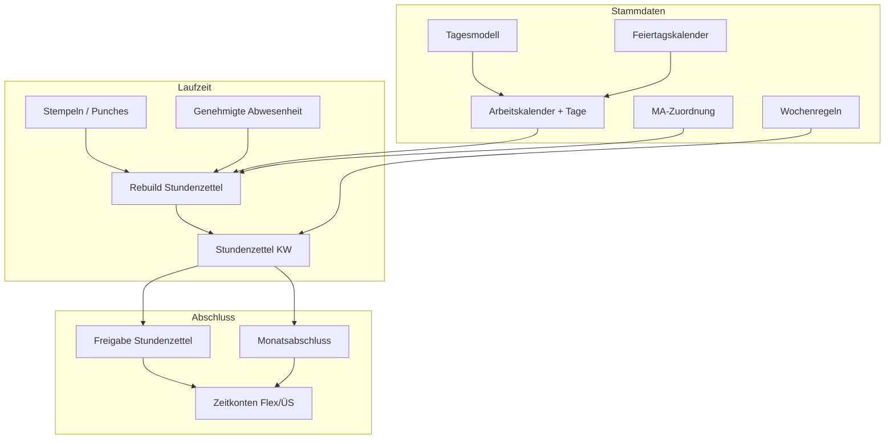

# Time model foundation (current)

PrimeWeb-inspired **work calendar** stack — source of truth for **Sollzeit**. Shift templates only create **planned shift instances**; they do not define Soll.

## Architecture



## Implemented

| Layer | Status |
|-------|--------|
| **DB** | `workday_models`, `holiday_calendars`, `work_calendars`, `work_calendar_days`, `employee_work_assignments`, `settlement_rules`; `timesheets.expected_minutes`, `balance_minutes`, `evaluation_json` |
| **Seed** | `wm-std-8h`, `wm-rest`, `wm-holiday-paid`; `wc-default-standard`; DE holidays; Mo–Fr year days; all active employees assigned (also after demo users are created) |
| **Compute** | Punches → daily Ist; calendar → daily Soll; holiday + approved absence credit; weekly balance + ArbZG warnings |
| **API** | Work calendars, assignments, day override, rebuild, timesheets with `evaluation` |
| **Tests** | `cargo test -p timeshards-db` — 18 integration tests (Berlin KW, Soll, punch rebuild, current-week ensure) |
| **Health** | `GET /health` → `time_foundation` (models, calendars, MA ohne Kalender, `current_week_drafts_without_soll`); `npm run foundation:health` |
| **Smoke** | `npm run verify:foundation` — DB tests + `smoke:api` (calendar, Soll, flex on approve, `current_week`) |
| **Konten** | `time_accounts` + `time_account_entries`; flex/overtime posted on timesheet **approve**; `GET /api/v1/time/accounts` |
| **Monatsabschluss** | `settlement_periods`; preview + close via API; aggregates approved weeks |
| **Kalender-Tools** | `POST …/copy-days` (KW kopieren); optional `worked_rounding_minutes` on Tagesmodell |
| **Umschaltplan** | `work_rotation_plans` + slots; optional on `work_calendars.rotation_plan_id`; seed `rp-14day-alt` |
| **Flex advisory** | Punch `clock_in`/`clock_out` returns optional `advisory` when outside Gleitzeit band |
| **Flex enforce** | `PUT /time/settlement-rules/{id}` + Server UI; blocks punch when `enforce_flex_band` |
| **Rebuild hooks** | Calendar day / copy / rotation → rebuild assigned employees; new assignment → 12 weeks; punch `clock_out`/`break_end` → current week; API start → stale KW drafts with Soll=0 |
| **UI weeks** | Client + Server week pickers sync via `GET /time/calendar-week` + Berlin `weekRangeContaining` |
| **Monats-Konten** | On month close: reconciliation delta vs weekly flex/ÜS postings (no double count) |
| **Work summary** | `GET /api/v1/me/work-summary` — `work_calendar_assigned`, queues, `current_week` (lazy draft rebuild) |
| **Tagesmodell PUT** | Config change → rebuild all calendars referencing that model |
| **UI Server** | Zeit tab: `WorkCalendarCard` (Kalender + Tagesmodell bearbeiten), `ShiftWeekCard`, `TimesheetsCard`, `TimeSettlementCard` |
| **Neuer MA** | `POST /admin/employees` mit `grant_work_calendar` (default) → Standard-Arbeitskalender + Rebuild |
| **Dashboard** | `employees_without_work_calendar`, `timesheets_current_week_no_soll`, **`time_access_mismatch_count`** / `time_access_mismatches[]`; **`POST /admin/foundation-fix`** |
| **Personnel** | `work_calendar_assigned` pro MA; Filter „ohne Arbeitskalender“; `grant-work-calendar` |
| **Reports** | Timesheet **HTML** export with **Tagesdetails** from `evaluation_json`; **Lohn-CSV** (`GET /reports/payroll/export`, Berlin month bounds) |
| **Go-Live** | `ProductionChecklistCard` + **`ProductionWizard`** on Übersicht; [PRODUCTION.md](./PRODUCTION.md) |
| **UI Client** | Pillars: Zeit, Freigaben, Abwesenheit, Zutritt, Konto; `ClientAppShell`, login/settings views |

## Calendar week boundary

**Monday 00:00 Europe/Berlin** (not UTC midnight) — matches German KW in UI and punch local time.

## Evaluation flow (short)

1. Resolve employee **work calendar** for the week.
2. Each day: holiday → else calendar day → **Tagesmodell**.
3. Approved **Urlaub/Krank/Sonder** → full-day Soll credit; **unbezahlt** → Soll 0.
4. **Rebuild** writes `worked_minutes`, `expected_minutes`, `balance_minutes`, `evaluation_json`.

See [TIME_MODEL.md](./TIME_MODEL.md) for terminology and API list.

## Not yet (later phases)

- DATEV bridge (CSV Lohn-Export exists: `GET /reports/payroll/export`)
- Rich payroll rules for `unbezahlt` (Soll 0 today; no Konten split yet)
- Bulk calendar editor beyond KW copy + generate-year

## Key commands

```powershell
npm run verify:foundation   # cargo test timeshards-db + smoke:api
npm run smoke:api           # headless API + full smoke
.\scripts\start_all.ps1
```

After schema changes: delete local SQLite or let migrations run on next API start.
